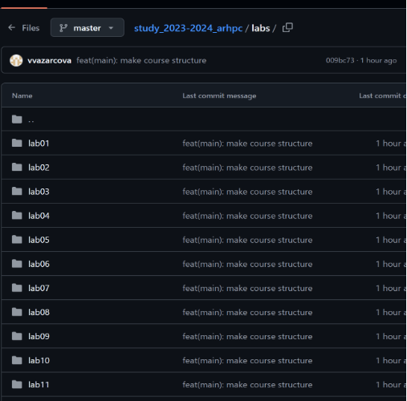

---
## Front matter
title: "Отчёт по лабораторной работе №2"
subtitle: "Дисциплина: Архитектура Компьютера"
author: "Азарцова Вероника Валерьевна"

## Generic otions
lang: ru-RU
toc-title: "Содержание"

## Bibliography
bibliography: bib/cite.bib
csl: pandoc/csl/gost-r-7-0-5-2008-numeric.csl

## Pdf output format
toc: true # Table of contents
toc-depth: 2
lof: true # List of figures
lot: true # List of tables
fontsize: 12pt
linestretch: 1.5
papersize: a4
documentclass: scrreprt
## I18n polyglossia
polyglossia-lang:
  name: russian
  options:
	- spelling=modern
	- babelshorthands=true
polyglossia-otherlangs:
  name: english
## I18n babel
babel-lang: russian
babel-otherlangs: english
## Fonts
mainfont: IBM Plex Serif
romanfont: IBM Plex Serif
sansfont: IBM Plex Sans
monofont: IBM Plex Mono
mathfont: STIX Two Math
mainfontoptions: Ligatures=Common,Ligatures=TeX,Scale=0.94
romanfontoptions: Ligatures=Common,Ligatures=TeX,Scale=0.94
sansfontoptions: Ligatures=Common,Ligatures=TeX,Scale=MatchLowercase,Scale=0.94
monofontoptions: Scale=MatchLowercase,Scale=0.94,FakeStretch=0.9
mathfontoptions:
## Biblatex
biblatex: true
biblio-style: "gost-numeric"
biblatexoptions:
  - parentracker=true
  - backend=biber
  - hyperref=auto
  - language=auto
  - autolang=other*
  - citestyle=gost-numeric
## Pandoc-crossref LaTeX customization
figureTitle: "Рис."
tableTitle: "Таблица"
listingTitle: "Листинг"
lofTitle: "Список иллюстраций"
lotTitle: "Список таблиц"
lolTitle: "Листинги"
## Misc options
indent: true
header-includes:
  - \usepackage{indentfirst}
  - \usepackage{float} # keep figures where there are in the text
  - \floatplacement{figure}{H} # keep figures where there are in the text
---

# Цель работы

Целью данной лабораторной работы является получение практических навыков работы с системой git; изучить идеологию и применение средств контроля версий.

# Задание

1. Выполнение лабораторной работы.
2. Задания для самостоятельной работы.

# Выполнение лабораторной работы

## Ход работы

### Настройка Github

1. Создаю учетную запись на сайте github.com под именем vvazarcova. (рис. [-@fig:1.1]).

{#fig:1.1 width=70%}

### Базовая настройка git

1. Делаю предварительную настройку git с помощью команд: git config --global user.name “azarcova”, git config --global user.email "<veronika.azartsova@gmail.com>” (рис. [-@fig:2.1]).

{#fig:2.1 width=70%}

2. Настраиваю utf-8 в выводе сообщений git. (рис. [-@fig:2.2]).

{#fig:2.2 width=70%}

3. Дам начальной ветке имя master. (рис. [-@fig:2.3]).

{#fig:2.3 width=70%}

4. Задаю параметр autocrlf. (рис. [-@fig:2.4]).

{#fig:2.4 width=70%}

5. Задаю параметр safecrlf. (рис. [-@fig:2.5]).

{#fig:2.5 width=70%}

### Создание SSH ключа

1. Генерирую пару ключей, приватный и открытый, для идентификации на сервере репозиториев. (рис. [-@fig:3.1]).

{#fig:3.1 width=70%}

2. Загружаю сгенерированный ключ открытый ключ на сайт github: захожу на http://github .org/ под своей учетной записью (рис. [-@fig:3.2]).

{#fig:3.2 width=70%}

3. Захожу в меню Settings (рис. [-@fig:3.3]).

{#fig:3.3 width=70%}

4. Выбираю раздел SSH and GPG keys (рис. [-@fig:3.4]).

{#fig:3.4 width=70%}

5. Нажимаю кнопку New SSH key и оказываюсь в меню загрузки SSH ключа (рис. [-@fig:3.5]).

{#fig:3.5 width=70%}

6. Копирую ключ из локальной консоли в буфер обмена (рис. [-@fig:3.6]).

{#fig:3.6 width=70%}

7. Вставляю ключ в появившееся на сайте поле и даю ему имя “Key”. (рис. [-@fig:3.7]).

{#fig:3.7 width=70%}

8. Получаю уведомление об успешном добавлении ключа “Key” от сайта.

### Создание рабочего пространства и репозитория курса на основе шаблона

1. Создаю каталог для предмета “Архитектура компьютера” по шаблону. (рис. [-@fig:4.1]).

{#fig:4.1 width=70%}

### Создание репозитория курса на основе шаблона

1. Перехожу на станицу репозитория с шаблоном курса и нажимаю Use this template (рис. [-@fig:5.1]).

{#fig:5.1 width=70%}

2. Задаю имя репозитория “study_2023–2024_arhpc” (рис. [-@fig:5.2]).

{#fig:5.2 width=70%}

3. Открываю терминал и перехожу в каталог курса (рис. [-@fig:5.3]).

{#fig:5.3 width=70%}
	
4. Клонирую созданный репозиторий, скопировав ссылку для клонирования на странице созданного репозитория (рис. [-@fig:5.4]).

{#fig:5.4 width=70%}

5. Перехожу в каталог курса (рис. [-@fig:5.5]).

{#fig:5.5 width=70%}

6. Удаляю лишние файлы (рис. [-@fig:5.6]).

{#fig:5.6 width=70%}
	
7. Создаю необходимые каталоги (рис. [-@fig:5.7]).

{#fig:5.7 width=70%}

8. Отправляю файлы на сервер с помощью команд add (рис. [-@fig:5.8]).

{#fig:5.8 width=70%}

9. Добавляю изменения с помощью команды commit (рис. [-@fig:5.9]).

{#fig:5.9 width=70%}

10. Выгружаю изменения на сервер с помощью команды push (рис. [-@fig:5.10]).

{#fig:5.10 width=70%}

11. Проверяю правильность иерархии в локальных файлах с помощью терминала. С помощью команды ls вижу что в ~/work/study/2023-2024/Архитектура компьютера/arch_pc находится каталог labs, а в нём в свою очередь находятся lab01, lab02, lab03 и т.д. до lab11. Значит, иерархия соблюдена. (рис. [-@fig:5.11]).

{#fig:5.11 width=70%}

12. Далее проверяю правильность иерархии на сайте github. Вижу, что в study_2023-2024_arhpc находится каталог labs, а в нём в свою очередь находятся lab01, lab02, lab03 и т.д. до lab11. Значит, иерархия соблюдена и задание выполнено успешно. (рис. [-@fig:5.12]).

{#fig:5.12 width=70%}

## Задания для самостоятельной работы

1. Перехожу в директорию labs/lab02/report и создаю отчет по выполнению данной лабораторной работы с помощью touch (рис. [-@fig:6.1]).

{#fig:6.1 width=70%}

2. Открываю в браузере Firefox сайт Google Docs (рис. [-@fig:6.2]).

{#fig:6.2 width=70%}

3. С помощью сайта работаю над отчетом в файле Л02_Азарцова_отчет (рис. [-@fig:6.3]).

{#fig:6.3 width=70%}

4. Нахожу файл отчета по лабораторной работы №1, который должен быть в “Загрузки” (рис. [-@fig:6.4]).

{#fig:6.4 width=70%}

5. Копирую файл в соответствующий каталог в рабочем пространстве курса (~/work/study/2023-2024/’Архитектура компьютера’/arch-pc/labs/lab01/report) (рис. [-@fig:6.5]).

{#fig:6.5 width=70%}

6. Проверяю наличие отчета в нужном каталоге с помощью ls и делаю вывод что копирование совершено успешно (рис. [-@fig:6.6]).

{#fig:6.6 width=70%}
	
7. Перехожу в каталог содержащий созданный файл и добавляю его в коммит с помощью команды add (рис. [-@fig:6.7]).

{#fig:6.7 width=70%}

8. Сохраняю изменения на сервере с помощью команды commit (рис. [-@fig:6.8]).

{#fig:6.8 width=70%}

9. Отправляю сохраненные изменения в главную ветку master командой push (рис. [-@fig:6.9]).

{#fig:6.9 width=70%}

10. Захожу на github и проверяю изменения. Вижу, что в истории изменений отображается добавление файла, значит, задача выполнена успешно (рис. [-@fig:6.10]).

{#fig:6.10 width=70%}

# Выводы

Подводя итоги проведенной лабораторной работы, я получила практические навыки по работе системой git. Я научилась подключать аккаунт github к файловой системе и загружать файлы на сервер используя шаблон курса и изучила средства контроля версий.

# Список литературы{.unnumbered}

::: {#refs}
:::
