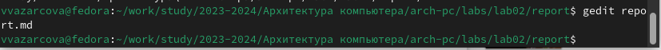

---
## Front matter
title: "Отчёт по лабораторной работе №3"
subtitle: "Дисциплина: Архитектура Компьютера"
author: "Азарцова Вероника Валерьевна"

## Generic otions
lang: ru-RU
toc-title: "Содержание"

## Bibliography
bibliography: bib/cite.bib
csl: pandoc/csl/gost-r-7-0-5-2008-numeric.csl

## Pdf output format
toc: true # Table of contents
toc-depth: 2
lof: true # List of figures
lot: true # List of tables
fontsize: 12pt
linestretch: 1.5
papersize: a4
documentclass: scrreprt
## I18n polyglossia
polyglossia-lang:
  name: russian
  options:
	- spelling=modern
	- babelshorthands=true
polyglossia-otherlangs:
  name: english
## I18n babel
babel-lang: russian
babel-otherlangs: english
## Fonts
mainfont: IBM Plex Serif
romanfont: IBM Plex Serif
sansfont: IBM Plex Sans
monofont: IBM Plex Mono
mathfont: STIX Two Math
mainfontoptions: Ligatures=Common,Ligatures=TeX,Scale=0.94
romanfontoptions: Ligatures=Common,Ligatures=TeX,Scale=0.94
sansfontoptions: Ligatures=Common,Ligatures=TeX,Scale=MatchLowercase,Scale=0.94
monofontoptions: Scale=MatchLowercase,Scale=0.94,FakeStretch=0.9
mathfontoptions:
## Biblatex
biblatex: true
biblio-style: "gost-numeric"
biblatexoptions:
  - parentracker=true
  - backend=biber
  - hyperref=auto
  - language=auto
  - autolang=other*
  - citestyle=gost-numeric
## Pandoc-crossref LaTeX customization
figureTitle: "Рис."
tableTitle: "Таблица"
listingTitle: "Листинг"
lofTitle: "Список иллюстраций"
lotTitle: "Список таблиц"
lolTitle: "Листинги"
## Misc options
indent: true
header-includes:
  - \usepackage{indentfirst}
  - \usepackage{float} # keep figures where there are in the text
  - \floatplacement{figure}{H} # keep figures where there are in the text
---

# Цель работы

Целью данной лабораторной работы является получение навыков оформления отчетов с помощью легковесного языка разметки Markdown.

# Задание

 1. Ознакомление с теоретическим введением
 2. Выполнение лабораторной работы
 3. Выполнение задач для самостоятельной работы

# Теоретическое введение
Синтаксис Markdown:  
Для создания заголовка используется знак "#".  
Для написания жирного текста необходимо заключить его в двойные звёздочки, и в одинарные звёздочки для курсива.  
Для создания блоков цитирования используется знак ">".  
Для создания упорядоченного списка используются цифры, а чтобы вложить список в другой необходимо добавить отступ.  
Неупорядоченный список создается с помощью звёздочек или тире.  
Синтаксис для встроенной ссылки состоит из части [link text], представляющей текст гиперссылки, и части (file-name.md) – URL-адреса или имени файла, на который дается ссылка.  
Чтобы выделить синтаксис для фрагмента кода используются огражденные блоки кода.  
Внутритекстовые формулы делаются аналогично формулам LaTeX.  
Изображение вставляется в документ с помощью непосредственного указания адреса изображения.  

# Выполнение лабораторной работы
## Ход работы
1. Открываю терминал и перехожу в каталог курса, сформированный при выполнении лабораторной работы №2 (рис. [-@fig:fig1]).

{#fig:fig1 width=70%}

2. Обновляю локальный репозиторий, скачав изменения из удаленного репозитория с помощью команды git pull (рис. [-@fig:fig2]).

{#fig:fig2 width=70%}

3. Перехожу в каталог с шаблоном отчета по лабораторной работе № 3 (рис. [-@fig:fig3]).

{#fig:fig3 width=70%}

4. Компилирую шаблон с использованием Makefile (рис. [-@fig:fig4]).

{#fig:fig4 width=70%}

5. Проверяю то, что файлы находятся в нужном каталоге. (рис. [-@fig:fig5])

{#fig:fig5 width=70%}

6. Проверяю содержимое файлов. Генерация прошла успешно. (рис. [-@fig:fig6]).

{#fig:fig6 width=70%}

7. Удаляю полученные файлы с использованием Makefile (рис. [-@fig:fig7]).

{ #fig:fig7 width=70% }

8. Проверяю, что после этой команды файлы report.pdf и report.docx были удалены (рис. [-@fig:fig8]).

{#fig:fig8 width=70%}

9. Открываю report.md с помощью gedit (рис. [-@fig:fig9]).

{#fig:fig9 width=70%}

10. Внимательно изучаю структуру этого документа (рис. [-@fig:fig10]).

{#fig:fig10 width=70%}

11. Заполняю отчёт.

{#fig:fig11 width=70%}

12. Компилирую отчет с использованием Makefile (рис. [-@fig:fig12]). 

{#fig:fig12 width=70%}

13. Проверяю корректность полученных файлов - файлы скомпилированны корректно (рис. [-@fig:fig13]).

{#fig:fig13 width=70%}

14. Загружаю файлы на Github.

## Задания для самостоятельной работы

1. Перехожу в каталог лабораторной работы №2 (рис. [-@fig:fig14]).

{#fig:fig14 width=70%}

2. Открываю отчёт с помощью gedit (рис. [-@fig:fig15]).

{#fig:fig15 width=70%}

3. Заполняю отчёт (рис. [-@fig:fig16]).

{#fig:fig16 width=70%}

4. Компилирую отчёт с помощью Makefile (рис. [-@fig:fig17]).

{#fig:fig17 width=70%}

5. Проверяю корректность содержимого файлов. Генерация прошла успешно. (рис. [-@fig:fig18]).

{#fig:fig18 width=70%}

6. Загружаю файлы на Github.

# Выводы

Подводя итоги проведенной лабораторной работы, я изучила синтаксис и получила практические навыки по работе с легковесным языком разметки Markdown.

# Список литературы{.unnumbered}

::: {#refs}
:::
