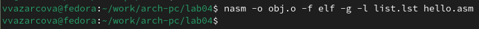

---
## Front matter
title: "Отчёт по лабораторной работе №3"
subtitle: "Дисциплина: Архитектура Компьютера"
author: "Азарцова Вероника Валерьевна"

## Generic otions
lang: ru-RU
toc-title: "Содержание"

## Bibliography
bibliography: bib/cite.bib
csl: pandoc/csl/gost-r-7-0-5-2008-numeric.csl

## Pdf output format
toc: true # Table of contents
toc-depth: 2
lof: true # List of figures
lot: true # List of tables
fontsize: 12pt
linestretch: 1.5
papersize: a4
documentclass: scrreprt
## I18n polyglossia
polyglossia-lang:
  name: russian
  options:
	- spelling=modern
	- babelshorthands=true
polyglossia-otherlangs:
  name: english
## I18n babel
babel-lang: russian
babel-otherlangs: english
## Fonts
mainfont: IBM Plex Serif
romanfont: IBM Plex Serif
sansfont: IBM Plex Sans
monofont: IBM Plex Mono
mathfont: STIX Two Math
mainfontoptions: Ligatures=Common,Ligatures=TeX,Scale=0.94
romanfontoptions: Ligatures=Common,Ligatures=TeX,Scale=0.94
sansfontoptions: Ligatures=Common,Ligatures=TeX,Scale=MatchLowercase,Scale=0.94
monofontoptions: Scale=MatchLowercase,Scale=0.94,FakeStretch=0.9
mathfontoptions:
## Biblatex
biblatex: true
biblio-style: "gost-numeric"
biblatexoptions:
  - parentracker=true
  - backend=biber
  - hyperref=auto
  - language=auto
  - autolang=other*
  - citestyle=gost-numeric
## Pandoc-crossref LaTeX customization
figureTitle: "Рис."
tableTitle: "Таблица"
listingTitle: "Листинг"
lofTitle: "Список иллюстраций"
lotTitle: "Список таблиц"
lolTitle: "Листинги"
## Misc options
indent: true
header-includes:
  - \usepackage{indentfirst}
  - \usepackage{float} # keep figures where there are in the text
  - \floatplacement{figure}{H} # keep figures where there are in the text
---

# Цель работы

Получение практических навыков по выполнению процедуры компиляции и сборки программ, написанных на ассемблере NASM.

# Задание

1. Ознакомление с теоретическим введением.
2. Создание программы.
3. Транслирование и компоновка.
4. Запуск полученного файла.
5. Выполнение заданий для самостоятельной работы

# Теоретическое введение

Основными функциональными элементами любой ЭВМ являются центральный процессор, память и периферийные устройства. Основной задачей процессора является обработка информации, а также организация координации всех узлов компьютера.  
Регистры — сверхбыстрая оперативная память небольшого объёма, входящая в состав процессора, для временного хранения промежуточных результатов выполнения инструкций, которые делятся на два типа: регистры общего назначения и специальные регистры.  
Большинство команд в программах написанных на ассемблере используют регистры в качестве операндов. Доступ к регистрам осуществляется не по адресам, как к основной памяти, а по именам. Каждый регистр процессора архитектуры x86 имеет свое название, состоящее из 2 или 3 букв латинского алфавита.   
Названия основных регистров общего назначения:  
RAX, RCX, RDX, RBX, RSI, RDI — 64-битные  
EAX, ECX, EDX, EBX, ESI, EDI — 32-битные  
AX, CX, DX, BX, SI, DI — 16-битные  
AH, AL, CH, CL, DH, DL, BH, BL — 8-битные  
Другим важным узлом ЭВМ является оперативное запоминающее устройство - ОЗУ — быстродействующее энергозависимое запоминающее устройство, которое напрямую взаимодействует с узлами процессора, предназначенное для хранения программ и данных, с которыми процессор непосредственно работает в текущий момент. ОЗУ состоит из одинаковых пронумерованных ячеек памяти. Номер ячейки памяти — это адрес хранящихся в ней данных.  
Коды команд представляют собой многоразрядные двоичные комбинации из 0 и 1. В коде машинной команды можно выделить две части: операционную и адресную. В операционной части хранится код команды, которую необходимо выполнить, в адресной части хранятся данные или адреса данных, которые участвуют в выполнении данной операции.  
При выполнении каждой команды процессор выполняет определённую последовательность стандартных действий, которая называется командным циклом процессора. Он заключается в следующем:  
1. формирование адреса в памяти очередной команды.  
2. считывание кода команды из памяти и её дешифрация.  
3. выполнение команды.  
4. переход к следующей команде.  
Язык ассемблера (asm) — машинно-ориентированный язык низкого уровня.  
NASM — это открытый проект ассемблера, версии которого доступны под различные операционные системы и который позволяет получать объектные файлы для этих систем.

# Выполнение лабораторной работы

## Программа Hello World!

Устанавливаю NASM (рис. [-@fig:1]).

{#fig:1 width=70%}

Создаю каталог для работы с программами на языке ассемблера NASM (рис. [-@fig:2]).

{#fig:2 width=70%}

Перехожу в созданный каталог (рис. [-@fig:3]).

{#fig:3 width=70%}

Создаю текстовый файл с именем hello.asm (рис. [-@fig:4]).

{#fig:4 width=70%}

Открываю файл с помощью текстового редактора gedit (рис. [-@fig:5]).

{#fig:5 width=70%}

Ввожу текст программы в текстовый файл (рис. [-@fig:6]).

{#fig:6 width=70%}

## Транслятор NASM

Компилирую написанный ранее текст программы в обьектный код (рис. [-@fig:7]).

{#fig:7 width=70%}

Проверяю, что транслятор преобразовал текст программы из hello.asm в hello.o. Преобразование произошло, следовательно, текст программы набран правильно. (рис. [-@fig:8]).

{#fig:8 width=70%}

С помощью опций команды nasm компилирую исходный файл hello.asm в obj.o с созданием файла листинга list.lst (рис. [-@fig:9]).

{#fig:9 width=70%}

С помощью команды ls проверяю, что файлы были созданы. Всё создано верно. (рис. [-@fig:10]).

{#fig:10 width=70%}

Обрабатываю обьектный файл компановщиком чтобы получить исполняемую программу (рис. [-@fig:11]).

{#fig:11 width=70%}

С помощью команды ls проверяю, что исполняемый файл hello был создан (рис. [-@fig:12]).

{#fig:12 width=70%}

Выполняю команду "ld -m elf_i386 obj.o -o main". При её выполнении исходный обьектный файл это obj.o, а полученный исполняемый файл - main (рис. [-@fig:13]).

{#fig:13 width=70%} 

Проверяю, что файл main был создан (рис. [-@fig:14]).

{#fig:14 width=70%}

## Запуск 

Запускаю на выполнение созданный исполняемый файл. Вижу, что вывелся нужный текст (рис. [-@fig:15]).

{#fig:15 width=70%}

## Задание для самостоятельной работы

1. В каталоге ~/work/arch-pc/lab04 с помощью команды cp создаю копию файла hello.asm с именем lab4.asm (рис. [-@fig:16]).

{#fig:16 width=70%}

С помощью ls проверяю, что файл был скопирован успешно (рис. [-@fig:17]).

{#fig:17 width=70%}

2. Открываю файл с помощью gedit (рис. [-@fig:18]).

{#fig:18 width=70%}

Измененяю текст программы в файле lab4.asm так, чтобы вместо Hello world! на экран выводилось "Азарцова Вероника" (рис. [-@fig:19]).

{#fig:19 width=70%}

3. Транслирую полученный текст программы lab4.asm в объектный файл (рис. [-@fig:20]).

{#fig:20 width=70%}

Проверяю наличие оттранслированного обьектного файла с помощью ls. (рис. [-@fig:21]).

{#fig:21 width=70%}

Выполняю компоновку объектного файла (рис. [-@fig:22]).

{#fig:22 width=70%}

Проверяю успешность компановки файла с помощью ls (рис. [-@fig:23]).

{#fig:23 width=70%}

Запускаю получившийся исполняемый файл (рис. [-@fig:24]).

{#fig:24 width=70%}

4. Копирую файл hello.asm в мой локальный репозиторий в каталог ~/work/study/2023-2024/"Архитектура компьютера"/arch-pc/labs/lab04/ (рис. [-@fig:25]).

{#fig:25 width=70%}

Аналогично копирую lab4.asm (рис. [-@fig:26]).

{#fig:26 width=70%}

Проверяю наличие скопированных файлов в нужном каталоге с помощью ls (рис. [-@fig:27]).

{#fig:27 width=70%}

Загружаю файлы на Github.

# Выводы

Подводя итоги проведённой лабораторной работе, я получила практические навыки по выполнению процедуры компиляции и сборки программ, написанных на ассемблере NASM.

# Список литературы{.unnumbered}

::: {#refs}
:::
