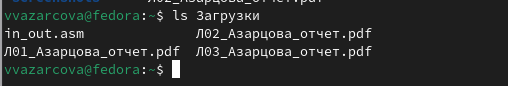
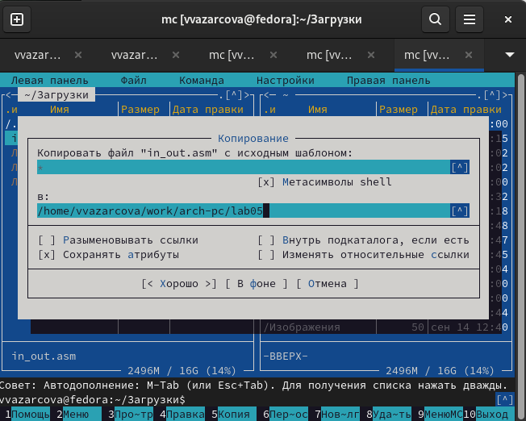
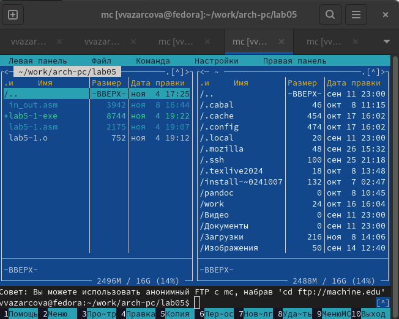
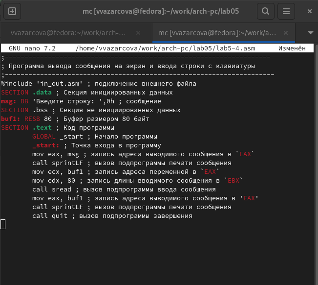

---
## Front matter
title: "Отчёт по лабораторной работе №4"
subtitle: "Дисциплина: Архитектура Компьютера"
author: "Азарцова Вероника Валерьевна"

## Generic otions
lang: ru-RU
toc-title: "Содержание"

## Bibliography
bibliography: bib/cite.bib
csl: pandoc/csl/gost-r-7-0-5-2008-numeric.csl

## Pdf output format
toc: true # Table of contents
toc-depth: 2
lof: true # List of figures
lot: true # List of tables
fontsize: 12pt
linestretch: 1.5
papersize: a4
documentclass: scrreprt
## I18n polyglossia
polyglossia-lang:
  name: russian
  options:
	- spelling=modern
	- babelshorthands=true
polyglossia-otherlangs:
  name: english
## I18n babel
babel-lang: russian
babel-otherlangs: english
## Fonts
mainfont: IBM Plex Serif
romanfont: IBM Plex Serif
sansfont: IBM Plex Sans
monofont: IBM Plex Mono
mathfont: STIX Two Math
mainfontoptions: Ligatures=Common,Ligatures=TeX,Scale=0.94
romanfontoptions: Ligatures=Common,Ligatures=TeX,Scale=0.94
sansfontoptions: Ligatures=Common,Ligatures=TeX,Scale=MatchLowercase,Scale=0.94
monofontoptions: Scale=MatchLowercase,Scale=0.94,FakeStretch=0.9
mathfontoptions:
## Biblatex
biblatex: true
biblio-style: "gost-numeric"
biblatexoptions:
  - parentracker=true
  - backend=biber
  - hyperref=auto
  - language=auto
  - autolang=other*
  - citestyle=gost-numeric
## Pandoc-crossref LaTeX customization
figureTitle: "Рис."
tableTitle: "Таблица"
listingTitle: "Листинг"
lofTitle: "Список иллюстраций"
lotTitle: "Список таблиц"
lolTitle: "Листинги"
## Misc options
indent: true
header-includes:
  - \usepackage{indentfirst}
  - \usepackage{float} # keep figures where there are in the text
  - \floatplacement{figure}{H} # keep figures where there are in the text
---

# Цель работы

Целью данной лабораторной работы является приобретение практических навыков работы в MC (Midnight Commander), изучение инструкций языка ассемблера mov и int, написание и запуск программ с системными вызовами для обеспечения диалога с пользователем, подключение и использование в программе внешнего файла.

# Задание

1. Изучение теоретического введения.
2. Выполнение лабораторной работы.
3. Выполнение заданий для самостоятельной работы.

# Теоретическое введение

## Основы работы с Midnight Commander

Midnight Commander (mc) — это программа, которая позволяет просматривать
структуру каталогов и выполнять основные операции по управлению файловой системой.  
В Midnight Commander используются функциональные клавиши F1 — F10 , к которым
привязаны часто выполняемые операции (табл. [-@tbl:std-dir])
Например, в табл. [-@tbl:std-dir] приведено краткое описание стандартных каталогов Unix.

: Описание часто выполняемых операций mc {#tbl:std-dir}

| F1-F10 | Описание выполняемой операции                                                                                                          |
|--------------|----------------------------------------------------------------------------------------------------------------------------|
| `F1`          | вызов контекстно-зависимой подсказки                                                                               |
| `F2 `      | вызов меню, созданного пользователем        |
| `F3`       | просмотр файла, на который указывает подсветка в активной панели                                           |
| `F4`      | вызов встроенного редактора для файла, на который указывает подсветка в активной панели                |
| `F5`     | копирование файла или группы отмеченных файлов из каталога, отображаемого в активной панели, в каталог, отображаемый на второй панели                                                             |
| `F6`      | перенос файла или группы отмеченных файлов из каталога, отображаемого в активной панели, в каталог, отображаемый на второй панели                                                                                   |
| `F7`       | создание подкаталога в каталоге, отображаемом в активной панели                                                      |
| `F8`       | удаление файла (подкаталога) или группы отмеченных файлов                                                               |
| `F9`       | вызов основного меню программы                                                       |
| `F10`       | выход из программы                                                       |

## Структура программы на языке ассемблера NASM

Программа на языке ассемблера NASM, как правило, состоит из трёх секций: секция кода программы (SECTION .text), секция инициированных (известных во время компиляции) данных (SECTION .data) и секция неинициализированных данных (тех, под которые во время компиляции только отводится память, а значение присваивается в ходе выполнения программы) (SECTION .bss).  
Для объявления инициированных данных в секции .data используются директивы DB, DW, DD, DQ и DT, которые резервируют память и указывают, какие значения должны храниться в этой памяти:  
* DB (define byte) — 1 байт;
* DW (define word) — 2 байта;
* DD (define double word) — 4 байта;
* DQ (define quad word) — 8 байт;
* DT (define ten bytes) — 10 байт.

## Элементы программирования

### Инструкция mov

Инструкция языка ассемблера mov предназначена для дублирования данных источника в приёмнике. В общем виде эта инструкция записывается в виде "mov dst,src".  
Здесь операнд dst — приёмник, а src — источник.

### Инструкция int

Инструкция языка ассемблера intпредназначена для вызова прерывания с указанным
номером. В общем виде она записывается в виде
int n
Здесь n — номер прерывания, принадлежащий диапазону 0–255.

### Системные вызовы для обеспечения диалога с пользователем

Вывести строку на экран можно используя системный вызов write под номером 4, поместив значение 4 в регистр eax. Первым аргументом write задаётся дескриптор файла. Для вывода на экран в качестве
дескриптора файла нужно указать 1 (стандартный вывод).  
Вторым аргументом задаётся адрес выводимой строки.  
Последним аргументом задается максимальная длина выводимой строки.  
Для ввода строки с клавиатуры можно использовать аналогичный системный вызов read с такими же аргументами, как у вызова write, но дескриптором файла 0 (стандартный ввод).  
Системный вызов exit является обязательным в конце любой программы на языке ассемблер. Для обозначения конца программы перед вызовом инструкции int 80h необходимо поместить в регистр еах значение 1, а в регистр ebx код завершения 0.

# Выполнение лабораторной работы

1. Ввожу команду mc. (рис. [-@fig:1]).

{#fig:1 width=70%}

Открывается Midnight Commander (рис. [-@fig:2]).

{#fig:2 width=70%}

2. Используя клавиши "вверх", "вниз" и "Enter", перехожу в каталог ~/work/arch-pc, созданный при выполнении лабораторной работы №4 (рис. [-@fig:3]).

{#fig:3 width=70%}

3. С помощью функциональной клавиши F7 создаю папку lab05 и перехожу в созданный каталог (рис. [-@fig:4]).

{#fig:4 width=70%}

4. Пользуясь строкой ввода, создаю файл lab5-1.asm (рис. [-@fig:5]).

{#fig:5 width=70%}

Проверяю, что файл создан. (рис. [-@fig:6]).

{#fig:6 width=70%}

5. С помощью функциональной клавиши "F4" открываю файл lab5-1.asm для редактирование во встроенном редакторе mcedit. (рис. [-@fig:7]).

{#fig:7 width=70%}

6. Ввожу текст программы. (рис. [-@fig:8]).

{#fig:8 width=70%}

Сохраняю изменения и закрываю файл (рис. [-@fig:9]).

{#fig:9 width=70%}

7. С помощью функциональной клавиши "F4" открываю файл lab5-1.asm, чтобы проверить, что он содержит файл программы (рис. [-@fig:10]).

{#fig:10 width=70%}

8. Транслирую текст программы lab5-1.asm в обьектный файл lab5-1.o и проверяю результат с помощью ls. (рис. [-@fig:11]).

{#fig:11 width=70%}

Выполняю компановку обьектного файла lab5-1.o в исполняемый файл lab5-1_exe и проверяю результат с помощью ls. (рис. [-@fig:12]).

{#fig:12 width=70%}

Запускаю получившийся файл. (рис. [-@fig:13]).

{#fig:13 width=70%}

Файл работает корректно: выводит приглашение и запрашивает ввод.

## Подключение внешнего файла in_out.asm

9. Скачиваю файл in_out.asm с курса в ТУИС в каталог Загрузки (рис. [-@fig:14]).

{#fig:14 width=70%}

10. В одной панели mc открываю каталог с файлом lab5-1.asm, в другой каталог со скаченным файлом in_out.asm. Копирую файл in_out.asm в каталог с файлом lab5-1.asm с помощью функциональной клавиши F5 (рис. [-@fig:15]).

{#fig:15 width=70%}

Проверяю наличие файла в нужном каталоге (рис. [-@fig:16]).

{#fig:16 width=70%}

11. С помощью функциональной клавиши F6 создаю копию файла lab5-1.asm с именем lab5-2.asm (рис. [-@fig:17]).

{#fig:17 width=70%}

12. Исправляю текст программы в файле lab5-2.asm с использование подпрограмм из внешнего файла in_out.asm (sprintLF, sread и quit) (рис. [-@fig:18]).

{#fig:18 width=70%}

Создаю исполняемый файл из lab5-2.asm и проверяю его работу (рис. [-@fig:19]).

{#fig:19 width=70%} 

13. Заменяю подпрограмму sprintLF на sprint в файле lab5-1.asm (рис. [-@fig:20]).

{#fig:20 width=70%} 

Создаю исполняемый файл и проверяю его работу (рис. [-@fig:21]).

{#fig:21 width=70%} 

Разница между программой со sprintLF и программой со sprint состоит в том, что первая программа, после вывода запроса, запрашивает ввод на новой строке, в то время как вторая запрашивает ввод на той же строке, где выводит запрос.

# Задания для самостоятельной работы

1. Создаю копию файла lab5-1.asm с помощью mc с названием lab5-3.asm (рис. [-@fig:22]).

{#fig:22 width=70%}

Требуется изменить программу так, чтобы она работала по следующему алгоритму:  
Вывести приглашение типа “Введите строку:”;  
Ввести строку с клавиатуры;  
Вывести введённую строку на экран.  
Для этого добавляю в исходную программу переменную buf1Len, в которой будет записана длина строки buf1, введеной пользователем.  
Далее, используя эту переменную
, пропишу системный вызов write, выводящий на экран содержимое переменной buf1 (рис. [-@fig:23]).

{#fig:23 width=70%}

2. Создаю исполняемый файл lab5-4-exe из lab5-3.asm и проверяю его работу (рис. [-@fig:24]).

{#fig:24 width=70%}

Программа выводит строку "Введите строку:", запрашивает ввод с клавиатуры, и затем выводит введеную пользователем строку, т.е. ФИО. Значит, программа работает корректно и согласно алгоритму.

3. Создаю копию файла lab5-2.asm с помощью mc с названием lab5-4.asm (рис. [-@fig:25]).

{#fig:25 width=70%} 

Требуется изменить программу аналогично пункту номер 1, то есть:  
Вывести приглашение типа “Введите строку:”;  
Ввести строку с клавиатуры;  
Вывести введённую строку на экран.  
Для этого, во-первых, меняю в исходной программе sprint обратно на sprintLF для более понятного ввода и вывода, т.к. поменяла это во время выполнения пункта номер 13 лабораторной работы.   
Далее, используя подпрограммы из внешнего файла in_out.asm, прописываю запись адреса введеного пользователем сообщения buf1 в EAX, и вызов подпрограммы печати сообщения sprintLF (рис. [-@fig:26]).

{#fig:26 width=70%}

2. Создаю исполняемый lab5-4-exe файл из lab5-4.asm и проверяю его работу (рис. [-@fig:27]).

{#fig:27 width=70%}

Программа выводит строку "Введите строку:", запрашивает ввод с клавиатуры, и затем выводит введеную пользователем строку, т.е. ФИО, и при этом использует внешний файл in_out.asm. Значит, программа работает корректно и согласно алгоритму.

# Выводы

Подводя итоги данной лабораторной работы, я научилась пользоваться Midnight Commander и успешно написала и запустила несколько программ с системными вызовами для обеспечения диалога с пользователем, использовав в нескольких из них внешний файл.

# Список литературы{.unnumbered}

::: {#refs}
:::
