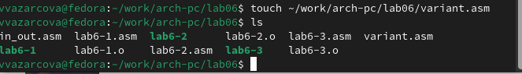
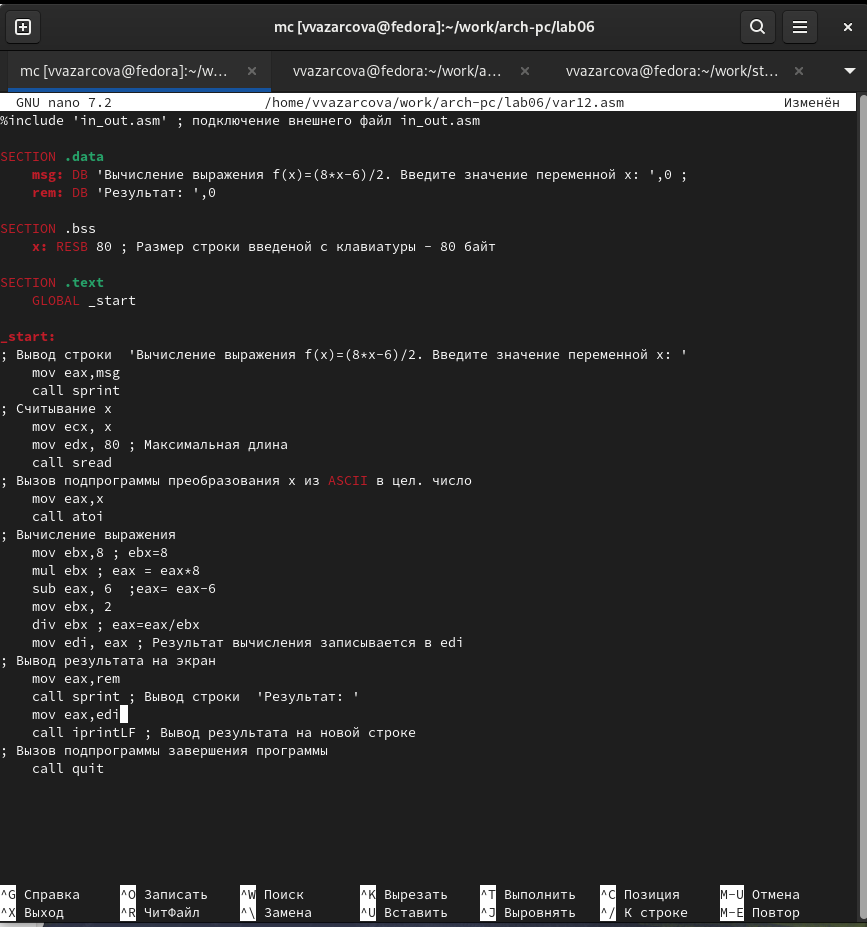

---
## Front matter
title: "Отчёт по лабораторной работе №6"
subtitle: "Дисциплина: Архитектура Компьютера"
author: "Азарцова Вероника Валерьевна"

## Generic otions
lang: ru-RU
toc-title: "Содержание"

## Bibliography
bibliography: bib/cite.bib
csl: pandoc/csl/gost-r-7-0-5-2008-numeric.csl

## Pdf output format
toc: true # Table of contents
toc-depth: 2
lof: true # List of figures
lot: true # List of tables
fontsize: 12pt
linestretch: 1.5
papersize: a4
documentclass: scrreprt
## I18n polyglossia
polyglossia-lang:
  name: russian
  options:
	- spelling=modern
	- babelshorthands=true
polyglossia-otherlangs:
  name: english
## I18n babel
babel-lang: russian
babel-otherlangs: english
## Fonts
mainfont: IBM Plex Serif
romanfont: IBM Plex Serif
sansfont: IBM Plex Sans
monofont: IBM Plex Mono
mathfont: STIX Two Math
mainfontoptions: Ligatures=Common,Ligatures=TeX,Scale=0.94
romanfontoptions: Ligatures=Common,Ligatures=TeX,Scale=0.94
sansfontoptions: Ligatures=Common,Ligatures=TeX,Scale=MatchLowercase,Scale=0.94
monofontoptions: Scale=MatchLowercase,Scale=0.94,FakeStretch=0.9
mathfontoptions:
## Biblatex
biblatex: true
biblio-style: "gost-numeric"
biblatexoptions:
  - parentracker=true
  - backend=biber
  - hyperref=auto
  - language=auto
  - autolang=other*
  - citestyle=gost-numeric
## Pandoc-crossref LaTeX customization
figureTitle: "Рис."
tableTitle: "Таблица"
listingTitle: "Листинг"
lofTitle: "Список иллюстраций"
lotTitle: "Список таблиц"
lolTitle: "Листинги"
## Misc options
indent: true
header-includes:
  - \usepackage{indentfirst}
  - \usepackage{float} # keep figures where there are in the text
  - \floatplacement{figure}{H} # keep figures where there are in the text
---

# Цель работы

Цель лабораторной работы - освоить арифметические инструкции в языке ассемблера NASM.

# Задание

1. Ознакомление с теоретическим введением

2. Выполнение лабораторной работы

3. Выполнение заданий для самостоятельной работы

# Теоретическое введение

## Адресация в NASM

Большинство инструкций на языке ассемблера требуют обработки операндов. Адрес операнда предоставляет место, где хранятся данные, подлежащие обработке. Это могут быть данные хранящиеся в регистре или в ячейке памяти. Далее рассмотрены все существующие способы задания адреса хранения операндов – способы адресации.
Существует три основных способа адресации:

* Регистровая адресация – операнды хранятся в регистрах и в команде используются имена этих регистров, например: mov ax,bx.

* Непосредственная адресация – значение операнда задается непосредственно в команде, Например: mov ax,2.

* Адресация памяти – операнд задает адрес в памяти. В команде указывается символическое обозначение ячейки памяти, над содержимым которой требуется выполнить операцию.

## Арифметические операции в NASM

1. Схема команды целочисленного сложения add (addition) выполняет сложение двух операндов и записывает результат по адресу первого операнда. Команда add работает как с числами со знаком, так и без знака:  
add (операнд_1), (операнд_2)

2. Команда целочисленного вычитания sub (subtraction) работает аналогично команде add:  
sub (операнд_1), (операнд_2)

3. Прибавление единицы называется инкрементом, а вычитание — декрементом. Для этих операций существуют специальные команды: inc (increment) и dec (decrement), которые увеличивают и уменьшают на 1 свой операнд:  
inc (операнд)
dec (операнд)

4. Команда изменения знака neg:
neg (операнд)

5. Умножение и деление, в отличии от сложения и вычитания, для знаковых и беззнаковых чисел производиться по-разному, поэтому существуют различные команды - mul (multiply) и imul:  
mul (операнд) - Беззнаковое умножение  
imul (операнд) - Знаковое умножение  
Для команд умножения один из сомножителей указывается в команде и должен находиться в регистре или в памяти, но не может быть непосредственным операндом. Второй сомножитель в команде явно не указывается и должен находиться в регистре EAX,AX или AL, а результат помещается в регистры EDX:EAX, DX:AX или AX, в зависимости от размера операнда (табл. [-@tbl:mul_nasm]). 

: Регистры, используемые командами умножения в NASM {#tbl:mul_nasm}

| Размер операнда     | Неявный множитель    | Результат умножения    | 
|---------------------|----------------------|------------------------|
| 1 Байт              | AL                   | AX                     |
| 2 Байта             | AX                   | DX:AX                  |
| 3 Байта             | EAX                  | EDX:EAX                |

6. Для деления, как и для умножения, существует две команды - div и
idiv:
div (делитель) - Беззнаковое деление
idiv (делитель) - Знаковое деление

В командах указывается только один операнд – делитель, который может быть регистром
или ячейкой памяти, но не может быть непосредственным операндом. Местоположение
делимого и результата для команд деления зависит от размера делителя. Кроме того, так как
в результате деления получается два числа – частное и остаток, то эти числа помещаются в
определённые регистры (табл. [-@tbl:div_nasm]).

: Регистры, используемые командами деления в NASM {#tbl:div_nasm}

| Размер операнда (делителя) | Делимое    | Частное    | Остаток    | 
|----------------------------|------------|------------|------------|
| 1 Байт                     | АX         | AL         | AH         |
| 2 Байта                    | DX:AX      | AX         | DX         |
| 3 Байта                    | EDX:EAX    | EAX        |            |

## Перевод символа числа в десятичную символьную запись

При вводе данных с клавиатуры, введенные дан-
ные будут представлять собой символы, что сделает невозможным получение корректного результата при выполнении над ними арифметических операций.  
Для решения этой проблемы необходимо проводить преобразование ASCII символов в числа и обратно. Для этого действия при выполнения лабораторных работ в файле in_out.asm реализованы подпрограммы . Это:

* iprint – вывод на экран чисел в формате ASCII, перед вызовом iprint в регистр eax необходимо записать выводимое число - mov eax,(int).

* iprintLF – работает аналогично iprint, но при выводе на экран после числа добавляет к символ перевода строки.

* atoi – функция преобразует ascii-код символа в целое число и записает результат в регистр eax, перед вызовом atoi в регистр eax необходимо записать число - mov eax, (int)

# Выполнение лабораторной работы

## Символьные и численные данные в NASM

1. Создаю каталог для программы лабораторной работы №6, перехожу в него, создаю файл lab6-1.asm и проверяю действия с помощью ls (рис. [-@fig:1]).

{#fig:1 width=70%}

2. Ввожу в файл lab6-1.asm текст программы, в которой в регистр eax записывается символ 6 (mov eax,'6'), в регистр ebx символ 4 (mov ebx,'4'), к значению в регистре eax прибавляется значение регистра ebx (add eax,ebx, результат сложения запишется в регистр eax), потом выводится результат. Так как для работы функции sprintLF в регистр eax должен быть записан адрес, необходимо использовать дополнительную переменную. Значение регистра eax записывается в переменную buf1
(mov [buf1],eax), а затем адрес переменной buf1 записывается в регистр eax (mov eax,buf1) и вызывается функция sprintLF.  
Для этого, открываю Midnight Commander с помощью команды mc (рис. [-@fig:2]).

{#fig:2 width=70%}

Далее, открываю lab6-1.asm и ввожу текст программы (рис. [-@fig:3]).

{#fig:3 width=70%}

Создаю исполняемый файл, проверяю создание файла командой ls и запускаю его (рис. [-@fig:4]).

{#fig:4 width=70%}

Программа выводит значение регистра eax, ожидается число 10, но результатом будет символ j, потому что код символа 6 равен 00110110, а код символа 4 - 00110100, и команда add записывает в регистр eax сумму кодов 01101010, что является кодом символа j.

3. Изменяю текст программы так, чтобы вместо символов записать в регистр цифры  (рис. [-@fig:5]).

{#fig:5 width=70%}

Создаю исполняемый файл, проверяю создание файла командой ls и запускаю его (рис. [-@fig:6]).

{#fig:6 width=70%}

Программа должна выводить символ на новой строке, выводятся две пустые строки. Согласно таблице ASCII, символ с кодом 10 это LF, т.е. символ перехода на новую строку, т.е. символ корректно отображается при выводе на экран (в виде новой, второй строки).

4. Создаю файл lab6-2.asm командой touch и проверяю его наличие командой ls (рис. [-@fig:7]).

{#fig:7 width=70%}

Открываю файл с помощью MC и ввожу текст программы (рис. [-@fig:8]).

{#fig:8 width=70%}

Создаю исполняемый файл, проверяю создание файла командой ls и запускаю его (рис. [-@fig:9]).

{#fig:9 width=70%}

В результате работы программы выводится число 106. Аналогично первой программе, команда add складывает коды символов '6' и '4', но в отличии от первой программы функция iprintLF выводит число, а не символ, кодом которого является это число.

5. Аналогично номеру три, изменю символы на числа в тексте программы (рис. [-@fig:10]).

{#fig:10 width=70%}

Создаю исполняемый файл, проверяю создание файла командой ls и запускаю его (рис. [-@fig:11]).

{#fig:11 width=70%}

Программа выводит число 10, т.к. теперь команда add складывает числа 4 и 6 и выводит результат в виде числа - 10.  
Заменю функцию iprintLF на iprint (рис. [-@fig:12]).

{#fig:12 width=70%}

Создаю исполняемый файл, проверяю создание файла командой ls и запускаю его (рис. [-@fig:13]).

{#fig:13 width=70%}

Программа выводит 10, но не на новой строке. В этом состоит разница между iprintLF и iprint - первая подпрограмма выводит результат на новую строку, а вторая нет.

## Выполнение арифметических операций в NASM

6. Создаю файл lab6-3.asm в каталоге лаборатной работы (рис. [-@fig:14]).

{#fig:14 width=70%}

Ввожу в lab6-3.asm программу вычисления выражения f(x)=(5*2+3)/3 (рис. [-@fig:15]).

{#fig:15 width=70%}

Создаю исполняемый файл, проверяю создание файла командой ls и запускаю его (рис. [-@fig:16]).

{#fig:16 width=70%}

Результат программы соответствует ожидаемому. 

Изменяю текст программы для вычисления выражения f(x)=(4*6+2)/5 (рис. [-@fig:17]).

{#fig:17 width=70%}

Создаю исполняемый файл, проверяю создание файла командой ls и запускаю его (рис. [-@fig:18]).

{#fig:18 width=70%}

Программа выводит результат 5 и остаток 1, значит, она работает верно (4*6=24; 24+2=26; 26/5=5, ост. 1).

7. Создаю файл variant.asm и проверяю его наличие с помощью ls (рис. [-@fig:19]).

{#fig:19 width=70%}

Ввожу текст программы вычисления варианта задания по номеру студенческого билета в variant.asm (рис. [-@fig:20]).

{#fig:20 width=70%}

Создаю исполняемый файл, проверяю создание файла командой ls и запускаю его (рис. [-@fig:21]).

{#fig:21 width=70%}

Программа запрашивает ввод. Я ввожу свой номер студенческого билета (1132246751), и программа выводит, что мой вариант - 12.  
Ответы на вопросы по выполнению лабораторной работы:  

1. За вывод на экран сообщения ‘Ваш вариант' отвечают следующие строки:  
 mov eax, rem  
 call sprint
 
2. Следующие инструкции  
 mov ecx, x  
 mov edx, 80  
 call sread  
используются для того, чтобы загрузить адрес переменной x в регистр ecx.

3. Инструкция "call atoi" вызывает подпрограмму из файла in_out.asm, которая переводит строку ASCII в целое число.

4. За вычисление варианта отвечают следующие строки:  
 xor edx, edx  
 mov ebx, 20  
 div ebx  
Эти комманды ищут остаток от деления номера студенческого билета на 20.

5. Остаток от деления при выполнении инструкции “div ebx” записывается в регистр edx.

6. Инструкция inc edx увеличивает значение в регистре edx на 1, для того, чтобы список возможных вариантов задания, вычисленных программой, начинался не с 0 а с 1.

7. За вывод на экран результата вычислений отвечают строки:  
 mov eax, edx  
 call iprintLF

# Задания для самостоятельной работы

1. Т.к. мой вариант задания - 12, мне нужно написать программу для вычисления выражения f(x)=(8*x-6)/2, которая будет выводить
выражение для вычисления, выводить запрос на ввод значения x, вычислять заданное выражение в зависимости от введенного x и выводить результат вычислений.

Создаю файл var12.asm в каталоге для выполнения лабораторной работы с помощью команды touch и проверяю его наличие командой ls (рис. [-@fig:22]).

{#fig:22 width=70%}

2. Открываю var12.asm с помощью MC и пишу код программы с пояснениями, аналогично программам, приведенным в пример в ходе лабораторной работы (рис. [-@fig:23]).

{#fig:23 width=70%}

* Сначала в программе я задаю переменные с текстом, который нужно будет вывести в её ходе, затем выделяю память на неинициированные данные, далее прописываю команду _start для начала работы программы.

* В тексте программы я вызываю подпрограмму sprint вывода строки и вывожу текст вычисляемого выражения и просьбу ввести x, задаю максимальную длину x, вызываю подпрограмму ввода с клавиатуры sread и записываю x в ecx. Затем, вызываю подпрограмму atoi для перевода x из строчки ASCII в целое число - целое число x записывается в eax.

* Далее, с помощью подпрограмм mul, sub и div (умножения, вычитания, деления), провожу нужные арифметические действия, при этом записывая значения с которыми работаю в ebx. В конце записываю значение результата в edi.

* Последними я вызываю подпрограммы sprint и iprintLF, чтобы вывести строку, обьявляющую результат, и затем вывести результат выражения на новой строке, переместив выводимое значение в eax перед каждой из подпрограмм.

3. Создаю исполняемый файл, проверяю создание файла командой ls и запускаю его (рис. [-@fig:24]).

{#fig:24 width=70%}

В итоге, программа выводит результат 1 при вводе числа 1 и результат 17 при вводе числа 5; Это верно, поскольку:

* (8*1-6)/2=2/2=1

* (8*5-6)/2=(40-6)/2=34/2=17

Значит, программа написана корректно.

# Выводы

Подводя итоги данной лабораторной работы, я закрепила знания работы подфункций из внешнего файла in_out.asm, научилась пользоваться арифметическими функциями и успешно написала и запустила несколько программ, производящих арифметические действия в NASM.

# Список литературы{.unnumbered}

::: {#refs}
:::
