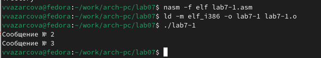
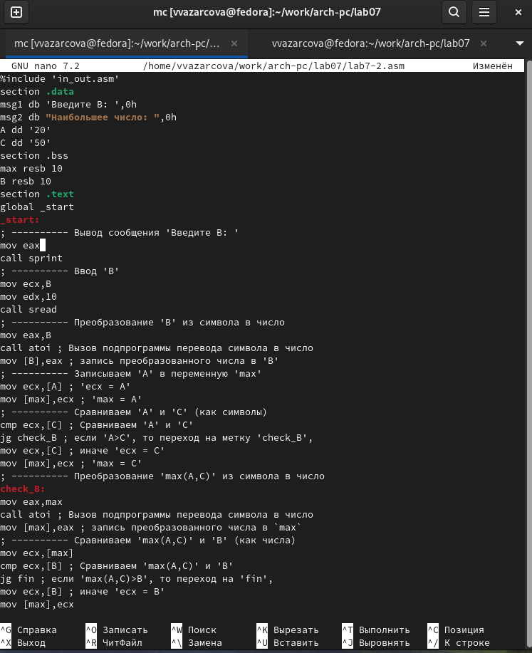

---
## Front matter
title: "Отчёт по лабораторной работе №7"
subtitle: "Дисциплина: Архитектура Компьютера"
author: "Азарцова Вероника Валерьевна"

## Generic otions
lang: ru-RU
toc-title: "Содержание"

## Bibliography
bibliography: bib/cite.bib
csl: pandoc/csl/gost-r-7-0-5-2008-numeric.csl

## Pdf output format
toc: true # Table of contents
toc-depth: 2
lof: true # List of figures
lot: true # List of tables
fontsize: 12pt
linestretch: 1.5
papersize: a4
documentclass: scrreprt
## I18n polyglossia
polyglossia-lang:
  name: russian
  options:
	- spelling=modern
	- babelshorthands=true
polyglossia-otherlangs:
  name: english
## I18n babel
babel-lang: russian
babel-otherlangs: english
## Fonts
mainfont: IBM Plex Serif
romanfont: IBM Plex Serif
sansfont: IBM Plex Sans
monofont: IBM Plex Mono
mathfont: STIX Two Math
mainfontoptions: Ligatures=Common,Ligatures=TeX,Scale=0.94
romanfontoptions: Ligatures=Common,Ligatures=TeX,Scale=0.94
sansfontoptions: Ligatures=Common,Ligatures=TeX,Scale=MatchLowercase,Scale=0.94
monofontoptions: Scale=MatchLowercase,Scale=0.94,FakeStretch=0.9
mathfontoptions:
## Biblatex
biblatex: true
biblio-style: "gost-numeric"
biblatexoptions:
  - parentracker=true
  - backend=biber
  - hyperref=auto
  - language=auto
  - autolang=other*
  - citestyle=gost-numeric
## Pandoc-crossref LaTeX customization
figureTitle: "Рис."
tableTitle: "Таблица"
listingTitle: "Листинг"
lofTitle: "Список иллюстраций"
lotTitle: "Список таблиц"
lolTitle: "Листинги"
## Misc options
indent: true
header-includes:
  - \usepackage{indentfirst}
  - \usepackage{float} # keep figures where there are in the text
  - \floatplacement{figure}{H} # keep figures where there are in the text
---

# Цель работы

Цель данной лабораторной работы - изучение команд условного и безусловного переходов, приобретение навыков написания программ с использованием переходов и знакомство с назначением и структурой файла листинга.

# Задание

1. Ознакомление с теоретическим введением

2. Выполнение лабораторной работы

3. Выполнение заданий для самостоятельной работы

# Теоретическое введение

Для реализации ветвлений в ассемблере используются так называемые команды передачи управления или команды перехода. Можно выделить 2 типа переходов:
* условный переход – выполнение или не выполнение перехода в определенную точку программы в зависимости от проверки условия.
* безусловный переход – выполнение передачи управления в определенную точку программы без каких-либо условий.

## Команды безусловного перехода

Безусловный переход выполняется инструкцией jmp (jump), которая включает в себя адрес перехода, куда следует передать управление:
```
jmp <адрес_перехода>
```
Например:
```
jmp label
jmp [label]
jmp eax
```
(Переход на метку label, переход по адресу в памяти, помеченному меткой label, переход по адресу из регистра eax)

## Команды условного перехода

Для условного перехода необходима проверка какого-либо условия. В ассемблере команды условного перехода анализируют флаги из регистра флагов.

### Регистр флагов

Флаг – это бит, принимающий значение 1 («флаг установлен»), если выполнено некоторое условие, и значение 0 («флаг сброшен») в противном случае. Флаги лишь для удобства помещены в единый регистр — регистр флагов, отражающий текущее состояние процессора.
Флаги состояния отражают результат выполнения арифметических инструкций (табл. [-@tbl:flg1]).

: Флаги состояния {#tbl:flg1}

| Имя каталога | Название          | Описание каталога                     |
|-----------|----------------|-------------------------------------------------------|
| СА           | Carry Flag           | Устанавливается в 1, если при выполнении предыдущей операции произошёл перенос из старшего бита или если требуется заём (при вычитании). Иначе установлен в 0. |
| PF           | Parity Flag          | Устанавливается в 1, если младший байт результата предыдущей операции содержит чётное количество битов, равных 1. |
| Af           | Auxiliary Carry Flag | Устанавливается в 1, если в результате предыдущей операции произошёл перенос (или заём) из третьего бита в четвёртый. |
| ZF           | Zero Flag            | Устанавливается 1, если результат предыдущей команды равен 0. |
| SF           | Sign Flag            | Равен значению старшего значащего бита результата, который является знаковым битом в знаковой арифметике.
| OF           | Overflow Flag        | Устанавливается в 1, если целочисленный результат слишком длинный для размещения в целевом операнде (регистре или ячейке памяти). |

### Описание инструкции cmp

Инструкция cmp является одной из инструкций, которая позволяет сравнить операнды и выставляет флаги в зависимости от результата сравнения:
```
cmp <операнд_1>, <операнд_2>
```
Единственным результатом команды сравнения является формирование флагов.

### Описание команд условного перехода

Команда условного перехода имеет вид
```
j<мнемоника перехода> label
```
Мнемоника перехода связана со значением анализируемых флагов или со способом фор-
мирования этих флагов. В табл. [-@tbl:flg2]  представлены команды условного перехода, которые обычно ставятся после команды сравнения cmp.

: Флаги состояния {#tbl:flg2}

| Типы операндов | Мнемокод  | Критерий условного перехода a v b | Значение флагов | Комментарий |
|----------------|--------------|--------------|--------------|---------------------------|
| Любые          | JE        | $a = b$ | ZF=1 | Переход если равно |
| Любые          | JNE       | $a ≠ b$ | ZF=0 | Переход если не равно |
| Со знаком      | JL/JNGE   | $a < b$ | SF≠OF | Переход если меньше |
| Со знаком      | JLE/JNG   | $a ≤ b$ | SF≠OF или ZF=1 | Переход если меньше или равно |
| Со знаком      | JG/JNLE   | $a > b$ | SF=OF и ZF=0  | Переход если больше |
| Со знаком      | JGE/JNL   | $a ≥ b$ | SF=OF | Переход если больше или равно |
| Без знака      | JB/JNAE   | $a < b$ | CF=1 | Переход если ниже |
| Без знака      | JBE/JNA   | $a ≤ b$ | CF=1 или ZF=1 | Переход если ниже или равно |
| Без знака      | JA/JNBE   | $a > b$ | CF=0 и ZF=0 | Переход если выше |
| Без знака      | JAE/JNB   | $a ≥ b$ | CF = 0  | Переход если выше или равно |

## Файл листинга и его структура

Листинг — это один из выходных файлов, создаваемых транслятором. Он имеет текстовый вид и нужен при отладке программы, так как кроме строк самой программы он содержит дополнительную информацию.  
Фрагмент файла листинга:
```
10 00000000 B804000000 mov eax,4
11 00000005 BB01000000 mov ebx,1
12 0000000A B9[00000000] mov ecx,hello
13 0000000F BA0D000000 mov edx,helloLen
14
15 00000014 CD80 int 80h
```
Строки первой части листинга имеют следующую структуру:

1. Номер строки — это номер строки файла листинга (не обязательно соответствует строкам в тексте программы);

2. Адрес — это смещение машинного кода от начала текущего сегмента;

3. Машинный код представляет собой ассемблированную исходную строку в виде шестнадцатеричной последовательности.

4. Исходный текст программы — строка исходной программы вместе с комментариями.

# Выполнение лабораторной работы

## Реализация переходов в NASM

1. Создаю каталог для программам лабораторной работы № 7, перехожу в него и создаю файл lab7-1.asm (рис. [-@fig:1]).

{#fig:1 width=70%}

2. Открываю файл lab7-1.asm с помощью NASM и ввожу текст программы с использованием инструкции jmp (рис. [-@fig:2]).

{#fig:2 width=70%}

Создаю исполняемый файл и запускаю его (рис. [-@fig:3]).

{#fig:3 width=70%}

Результат выполнения программы соответсвует ожиданиям. Использование инструкции jmp меняет порядок исполнения инструкций, следовательно, программа сразу переходит к выводу сообщения два и три, не выводя первое.  
Изменю программу таким образом, чтобы она выводила сначала ‘Сообщение №2’, потом ‘Сообщение №1’ и завершала работу (рис. [-@fig:4]).

{#fig:4 width=70%}

Создаю исполняемый файл и запускаю его (рис. [-@fig:5]).

{#fig:5 width=70%}

Результат выполнения программы соответсвует ожиданиям: программа сначала выводит второе сообщение, затем первое, после чего завершает работу.  
Изменю текст программы так, чтобы программа выводила сообщения в обратном порядке, т.е. сначала выводила третье сообщение, затем второе, затем первое. Для этого поменяю jmp _label2 в самом начале программы на jmp _label3 и добавлю jmp _label2 после вывода третьего сообщения. Т.к. после второго сообщения и так уже выводится первое, а после первого уже и так вызывается завершение программы, программа будет выводить третье, второе, а затем первое сообщение (рис. [-@fig:6]).

{#fig:6 width=70%}

Создаю исполнительный файл и проверяю работу программы (рис. [-@fig:7]).

{#fig:7 width=70%}

Результат выполнения программы соответствует ожиданиям.

3. Создаю файл lab7-2.asm (рис. [-@fig:8]).

{#fig:8 width=70%}

Ввожу в lab7-2.asm текст программы, использующей условные переходы для того, чтобы вывести наибольшую из трех переменный, две из которых задаются в тексте программы, и одна вводится с клавиатуры (рис. [-@fig:9]).

{#fig:9 width=70%}

Создаю исполняемый файл и запускаю его (рис. [-@fig:10]).

{#fig:10 width=70%}

В этой программе, переменные A и С сравниваются как символы, а переменная B и максимум из A и С как числа. Функция работает соответствует ожиданиям: при вводе 100, функция выводит сообщение о том, что наибольшее число 100, т.к. 100>50>20. При вводе 5, функция выводит, что наибольшее число 50, т.к. 50>20>5.

## Изучение структуры файлы листинга

4. Создаю файл листинга для программы из файла lab7-2.asm (рис. [-@fig:11]).

{#fig:11 width=70%}

Открываю файл листинга с помощью mcedit - командой "mcedit lab7-2.lst" (рис. [-@fig:12]).

{#fig:12 width=70%}

Обьясню содержимое первых трёх строк файла листинга.

1.  4 00000000 53 push ebx

* 4 это просто номер строки в листинге, не имеющий отношения к тексту программы. Он нужен для удобства чтения листинга.

* 00000000 это адрес в памяти, по которому находится инструкция. В этом случае, адрес 00000000 — это начало этой инструкции в памяти программы.

* 53 это машинный код инструкции. Когда программа собирается в машинный код, каждая инструкция преобразуется в набор байтов. В этом случае, 53 - шестнадцатиричное представление команды push ebx.

*  push ebx - исходная команда на языке ассемблера, она означает что содержимое ebx помещается в стек.

2. 5 00000001 89С3 mov ebx, eax

* 5 - аналогично, номер строки в листинге.

* 00000002 - аналогично, адрес в памяти, по которому хранится инструкция mov ebx, eax.

* 89С3 - аналогично, машинный код для команды mov ebx, eax в виде шестнадцатиричного числа.

* mov ebx, eax - аналогично, исходная команда на языке ассемблера, которая копирует содержимое регистра eax в регистр ebx.

3. 8 00000003 803800 cmp byte [eax], 0

* 8 - аналогично, номер строки в листинге.

* 00000003 - аналогично, алрес в памяти, по которому хранится инструкция cmp byte [eax], 0.

* 89С3 - аналогично, машинный код для команды cmp byte [eax], 0 в виде шестнадцатиричного числа.

* cmp byte [eax], 0 - аналогично, исходная команда на языке ассемблера, которая копирует содержимое регистра eax в регистр ebx.

Открываю файл с программой lab2-1.asm и в строчке "mov eax, msg1" удаляю операнд msg1 (рис. [-@fig:13]).

{#fig:13 width=70%}

Выполняю трансляцию с получением файла листинга (рис. [-@fig:14]).

{#fig:14 width=70%}

При этом, терминал выводит ошибку, и создается только листинг, без создания обьектного файла. Проверяю содержимое листинга и вижу, что теперь в нем появилась такая же ошибка, как в терминале (рис. [-@fig:15]).

{#fig:15 width=70%}

# Задание для самостоятельной работы

1. Мне требуется написать программу нахождения наименьшей из 3 целочисленных переменных a, b и c, создать исполняемый файл и проверить его работу. Т.к. мой вариант - 12, значения переменных будут следующими: a=99, b=29, c=26.  
Создам файл lab7-3.asm (рис. [-@fig:16]).

{#fig:16 width=70%}

Напишу требуемую команду в lab7-3.asm, основываясь на программе, которую я ввела во время выполнения лабораторной работы (рис. [-@fig:17]).

{#fig:17 width=70%}

Программа аналогична тексту программы из lab7-2.asm, но отличается тем, что B задается в тексте самой программы, и все переменные сразу переводятся в числа. Поэтому, в отличии от lab7-2.asm, я задала В в начале программы, и вызвала команду atoi для каждой из трех переменных, только после чего я их сравнила.  

***Листинг 7.1 - первая программа***
``` NASM
%include 'in_out.asm'
section .data
msg db "Наибольшее число: ",0h
A dd '99'
B dd '29'
C dd '26'
section .bss
max resb 10
section .text
global _start
_start:
; ---------- Преобразование 'A' из символа в число
mov eax,A
call atoi ; Вызов подпрограммы перевода символа в число
mov [A],eax ; запись преобразованного числа в 'A'
; ---------- Преобразование 'B' из символа в число
mov eax,B
call atoi ; Вызов подпрограммы перевода символа в число
mov [B],eax ; запись преобразованного числа в 'B'
; ---------- Преобразование 'C' из символа в число
mov eax,C
call atoi ; Вызов подпрограммы перевода символа в число
mov [C],eax ; запись преобразованного числа в 'C'
; ---------- Записываем 'A' в переменную 'max'
mov ecx,[A] ; 'ecx = A'
mov [max],ecx ; 'max = A'
; ---------- Сравниваем 'A' и 'С' (как символы)
cmp ecx,[C] ; Сравниваем 'A' и 'С'
jg check_B ; если 'A>C', то переход на метку 'check_B',
mov ecx,[C] ; иначе 'ecx = C'
mov [max],ecx ; 'max = C'
; ---------- Преобразование 'max(A,C)' из символа в число
check_B:
; ---------- Сравниваем 'max(A,C)' и 'B' (как числа)
mov ecx,[max]
cmp ecx,[B] ; Сравниваем 'max(A,C)' и 'B'
jg fin ; если 'max(A,C)>B', то переход на 'fin',
mov ecx,[B] ; иначе 'ecx = B'
mov [max],ecx
; ---------- Вывод результата
fin:
mov eax, msg
call sprint ; Вывод сообщения 'Наибольшее число: '
mov eax,[max]
call iprintLF ; Вывод 'max(A,B,C)'
call quit ; Выход
```

Создаю исполнительный файл и проверяю его работу (рис. [-@fig:18]).

{#fig:18 width=70%}

Программа выводит сообщение о том, что наибольшее число 99, что верно, т.к. 99>29>26. Значит, программа работает корректно.

2. Мне требуется написать программу, которая для введенных с клавиатуры значений х и а вычисляет значение заданной функции f(x) и выводит результат вычислений, создать исполняемый файл и проверить его работу для значений х=3, а=7 и х=6, а=4.  
Т.к. мой вариант - 12, мне нужно создать эту программу для функции следующего вида:  

$$
f(n) =
  \begin{cases}
    ax            & \quad \text{x<5}\\
    x−5       & \quad \text{x>=5}
  \end{cases}
$$

Создаю lab7-4.asm (рис. [-@fig:19]).

{#fig:19 width=70%}

Пишу программу в lab7-4.asm (рис. [-@fig:20]).

{#fig:20 width=70%}

***Листинг 7.1 - вторая программа***
``` NASM
%include 'in_out.asm' ; подключение внешнего файла in_out.asm

SECTION .data
    msg_a: DB 'Введите значение переменной a: ', 0
    msg_x: DB 'Введите значение переменной x: ', 0
    msg_result: DB 'Результат: ', 0

SECTION .bss
    a RESB 11 ; Размер строки для ввода a
    x RESB 11 ; Размер строки для ввода x
    result RESB 12 ; Для хранения результата

SECTION .text
    GLOBAL _start

_start:
    ; Ввод a
    mov eax, msg_a
    call sprint
    mov ecx, a
    mov edx, 10 ; Максимальная длина
    call sread
    mov eax, a
    call atoi
    mov [a], eax ; Сохраняем a в ebx

    ; Ввод x
    mov eax, msg_x
    call sprint
    mov ecx, x
    mov edx, 10 ; Максимальная длина
    call sread
    mov eax, x
    call atoi
    mov [x], eax ; Сохраняем x в ecx

    ; Проверка x < 5
    mov eax, [x]
    cmp eax, 5
    jl _a_x
    jge _x_5
_x_5:
    mov eax, [x] ; Загружаем a
    sub eax, 5 ; Загружаем 5
    mov ecx, eax ; Переносим результат
    jmp _res

_a_x:
    ; Вычисляем a*x
    mov eax, [x] ; Загружаем a
    mov ebx, [a] ; Загружаем x
    mul ebx ; Умножаем a на x
    jmp _res

_res:
    ; Подготовка результата для вывода
    mov edi, eax ; Результат находится в eax
    mov eax, msg_result
    call sprint ; Вывод строки 'Результат: '
    mov eax, edi
    call iprintLF ; Вывод результата на новой строке

    ; Завершение программы
    call quit
```

Создаю исполняемый файл и запускаю его, проверяя два разных варианта переменных, соответсвующих моему варианту (рис. [-@fig:21]).

{#fig:21 width=70%}

Программа выводит 21 и 1, что является правильными значениями (3*7=21, 6-5=1).

# Выводы

Подводя итоги проведенной лабораторной работе, я научилась использовать команды условного и безусловного переходов и написала две программы с их применением.

# Список литературы{.unnumbered}

::: {#refs}
:::
