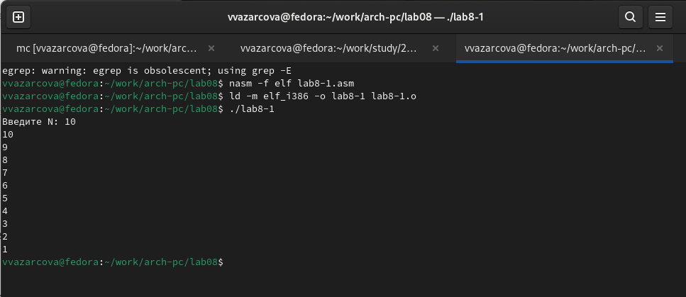
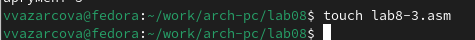
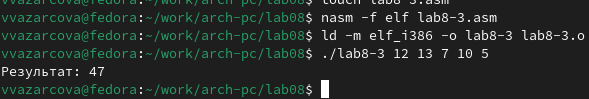

---
## Front matter
title: "Отчёт по лабораторной работе №8"
subtitle: "Дисциплина: Архитектура Компьютера"
author: "Азарцова Вероника Валерьевна"

## Generic otions
lang: ru-RU
toc-title: "Содержание"

## Bibliography
bibliography: bib/cite.bib
csl: pandoc/csl/gost-r-7-0-5-2008-numeric.csl

## Pdf output format
toc: true # Table of contents
toc-depth: 2
lof: true # List of figures
lot: true # List of tables
fontsize: 12pt
linestretch: 1.5
papersize: a4
documentclass: scrreprt
## I18n polyglossia
polyglossia-lang:
  name: russian
  options:
	- spelling=modern
	- babelshorthands=true
polyglossia-otherlangs:
  name: english
## I18n babel
babel-lang: russian
babel-otherlangs: english
## Fonts
mainfont: IBM Plex Serif
romanfont: IBM Plex Serif
sansfont: IBM Plex Sans
monofont: IBM Plex Mono
mathfont: STIX Two Math
mainfontoptions: Ligatures=Common,Ligatures=TeX,Scale=0.94
romanfontoptions: Ligatures=Common,Ligatures=TeX,Scale=0.94
sansfontoptions: Ligatures=Common,Ligatures=TeX,Scale=MatchLowercase,Scale=0.94
monofontoptions: Scale=MatchLowercase,Scale=0.94,FakeStretch=0.9
mathfontoptions:
## Biblatex
biblatex: true
biblio-style: "gost-numeric"
biblatexoptions:
  - parentracker=true
  - backend=biber
  - hyperref=auto
  - language=auto
  - autolang=other*
  - citestyle=gost-numeric
## Pandoc-crossref LaTeX customization
figureTitle: "Рис."
tableTitle: "Таблица"
listingTitle: "Листинг"
lofTitle: "Список иллюстраций"
lotTitle: "Список таблиц"
lolTitle: "Листинги"
## Misc options
indent: true
header-includes:
  - \usepackage{indentfirst}
  - \usepackage{float} # keep figures where there are in the text
  - \floatplacement{figure}{H} # keep figures where there are in the text
---

# Цель работы

Целью данной лабораторной работы является приобретение навыков написания программ с использованием циклов и обработкой аргументов командной строки.

# Задание

1. Ознакомление с теоретическим введением

2. Выполнение лабораторной работы

3. Выполнение заданий для самостоятельной работы

# Теоретическое введение

## Организация стека

Стек — это структура данных, организованная по принципу LIFO («Last In — First Out» или «последним пришёл — первым ушёл»). Стек является частью архитектуры процессора и реализован на аппаратном уровне. Для работы со стеком в процессоре есть специальные регистры (ss, bp, sp) и команды.  
Основной функцией стека является функция сохранения адресов возврата и передачи аргументов при вызове процедур. Кроме того, в нём выделяется память для локальных переменных и могут временно храниться значения регистров.  
Стек имеет вершину, адрес последнего добавленного элемента, который хранится в регистре esp (указатель стека). Противоположный конец стека называется дном. Значение, помещённое в стек последним, извлекается первым. При помещении значения в стек указатель стека уменьшается, а при извлечении — увеличивается.
Для стека существует две основные операции:

* добавление элемента в вершину стека (push);

* извлечение элемента из вершины стека (pop).

### Добавление элемента в стек.

Команда push размещает значение в стеке, т.е. помещает значение в ячейку памяти, на которую указывает регистр esp, после этого значение регистра esp увеличивается на 4. Данная команда имеет один операнд — значение, которое необходимо поместить в стек.  
Примеры:

```NASM
push -10 ; Поместить -10 в стек
push ebx ; Поместить значение регистра ebx в стек
push [buf] ; Поместить значение переменной buf в стек
push word [ax] ; Поместить в стек слово по адресу в ax
```

Существует ещё две команды для добавления значений в стек. Это команда pusha, которая помещает в стек содержимое всех регистров общего назначения в следующем порядке: ах, сх, dx, bх, sp, bp, si, di. А также команда pushf, которая служит для перемещения в стек содержимого регистра флагов. Обе эти команды не имеют операндов.

### Извлечение элемента из стека.

Команда pop извлекает значение из стека, т.е. извлекает значение из ячейки памяти, на которую указывает регистр esp, после этого уменьшает значение регистра esp на 4. У этой команды также один операнд, который может быть регистром или переменной в памяти. Нужно помнить, что извлечённый из стека элемент не стирается из памяти и остаётся как “мусор”, который будет перезаписан при записи нового значения в стек.  
Примеры:

```NASM
pop eax ; Поместить значение из стека в регистр eax
pop [buf] ; Поместить значение из стека в buf
pop word[si] ; Поместить значение из стека в слово по адресу в si
```

Аналогично команде записи в стек существует команда popa, которая восстанавливает
из стека все регистры общего назначения, и команда popf для перемещения значений из
вершины стека в регистр флагов.  
## Инструкции организации циклов
Для организации циклов существуют специальные инструкции. Для всех инструкций максимальное количество проходов задаётся в регистре ecx. Наиболее простой является инструкция loop. Она позволяет организовать безусловный цикл, типичная структура которого имеет следующий вид:

```NASM
mov ecx, 100 ; Количество проходов
NextStep:
...
... ; тело цикла
...
loop NextStep ; Повторить `ecx` раз от метки NextStep
```

Иструкция loop выполняется в два этапа. Сначала из регистра ecx вычитается единица и его значение сравнивается с нулём. Если регистр не равен нулю, то выполняется переход к указанной метке. Иначе переход не выполняется и управление передаётся команде, которая следует сразу после команды loop.

# Выполнение лабораторной работы

## Реализация циклов в NASM

Создаю каталог для программ лабораторной работы № 8, перехожу в него и создаю файл lab8-1.asm (рис. [-@fig:1]).

{#fig:1 width=70%}

Ввожу в файл lab8-1.asm текст программы из первого листинга лабораторной работы, демонстрирующей работу работу циклов в NASM и показывающей то, что использование регистра ecx в теле цилка loop может привести к некорректной работе программы (рис. [-@fig:2]).

{#fig:2 width=70%}

Создаю исполняемый файл и проверяю его работу введя с клавиатуры число 10 (рис. [-@fig:3]).

{#fig:3 width=70%}

Работа программы соответствует ожиданиям: она выводит все числа от 10 до 1.  

Изменяю текст программы добавив изменение значение регистра ecx в цикле (рис. [-@fig:4]).

{#fig:4 width=70%}

Создаю исполняемый файл и проверяю его работу введя с клавиатуры число 10 (рис. [-@fig:5]).

{#fig:5 width=70%}

Если рассмотреть значение ecx пошагово, то после ввода с клавиатуры ему присвается значение 10, затем происходит первая итерация цикла, выполняется sub ecx,1; ecx принимает значение 9 и это значение выводится в терминале. Программа доходит до loop, что уменьшает значение ecx на 1 и оно становится 8. Далее, аналогично повторяется то же самое (ecx=8-1=7, 7 выводится, в loop ecx=7-1=6 и т.д.).  
Таким образом, ecx во время выполнения программы принимает все значения от 10 до 0, но выводятся только 9, 7, 5, 3 и 1.  
Число проходов цикла не соответствует значению N, введенному с клавиатуры, т.к. шаг уменьшения ecx больше не равен 1.  

Вношу изменения в текст программы добавив команды push и pop (добавления в стек и извлечения из стека) для сохранения значения счетчика цикла loop, для демонстрации использования регистра ecx в цикле с сохранением корректности программы используя стек (рис. [-@fig:6]).

{#fig:6 width=70%}

Создаю исполняемый файл и проверяю его работу введя с клавиатуры число 10 (рис. [-@fig:7]).

{#fig:7 width=70%}

Теперь, число проходов цикла соответствует значению N, введенному с клавиатуры. Но числовые значения ecx, выводимые в терминал, все уменьшились на 1.

## Обработка аргументов командной строки

Создаю файл lab8-2.asm в каталоге лабораторной работы №8 (рис. [-@fig:8]).

{#fig:8 width=70%}

Ввожу текст программы из листинга лабораторной работы, которая выводит на экран аргументы командной строки, в lab8-2.asm (рис. [-@fig:9]).

{#fig:9 width=70%}

Создаю исполняемый файл и запускаю его, введя агрументы "./lab8-2 аргумент1 аргумент 2 'аргумент 3'" (рис. [-@fig:10]).

{#fig:10 width=70%}

Программой было обработано 4 аргумента, т.к. она воспринимает "аргумент 2" как два разных аргумента, разделенных пробелом. С последним аргументом это не случилось, т.к. он был введен в скобках, обозначающих что он - одна целая строка.  

Создаю файл lab8-3.asm в каталоге лабораторной работы №8 (рис. [-@fig:11]).

{#fig:11 width=70%}

Ввожу текст программы из листинга лабораторной работы,  которая выводит сумму чисел, которые передаются в программу как аргументы, в lab8-2.asm (рис. [-@fig:12]).

{#fig:12 width=70%}

Создаю исполняемый файл и запускаю его, введя агрументы "./lab8-2 12 13 7 10 5" (рис. [-@fig:13]).

{#fig:13 width=70%}

Результат соответствует предложенному в лабораторной работе.
# Задания для самостоятельной работы

Создам файл lab8-4.asm в каталоге лабораторной работы №8 для выполнения задания (рис. [-@fig:14]).

{#fig:14 width=70%}

Мне требуется написать программу, которая находит сумму значений функции f(x) для x = x1, x2, ..., xn. Т.к. мой вариант - 12, f(x)=15*x+2.   
Как пример такой программы возьму программу по выводу суммы аргументов, созданной в  ходе выполнения лабораторной работы. Напишу аналогичную программу, но пропишу то, что аргумент сначала используется в формуле, а только потом результат формулы добавляется в сумму. Также, мне требуется поменять регистр в строчке pop edx, где записыватся имя программы, т.к. edx далее используется в умножении (рис. [-@fig:15]).

{#fig:15 width=70%}

***Листинг программы, вычисляющей сумму значений функции от введеных аргументов***
``` NASM                                    
%include 'in_out.asm'
SECTION .data
msg db "Результат: ",0
SECTION .text
global _start
_start:
pop ecx    ; кол-в аргументов (первое знач. стека)
pop ebx  ; имя программы (второе знач. в стеке)
sub ecx, 1 ; кол-во аргументов без названия программы (ecx=ecx-1)
mov esi, 0 ; промежуточные суммы
next:
cmp ecx,0h ; проверяем наличие аргументов
jz _end ; если нет, переходим на '_end'
mov edx, 15
pop eax ; извлекаем следующий аргумент из стека
call atoi ; преобразуем в число
mul edx
add eax, 2
add esi,eax ; добавляем к промежуточной сумме
loop next ; переход к обработке следующего аргумента
_end:
mov eax, msg ; вывод сообщения "Результат: "
call sprint
mov eax, esi ; записываем сумму в регистр `eax`
call iprintLF ; печать результата
call quit ; завершение программы

```

Создаю исполнительный файл и проверяю работу программы сначала с аргументом 1, затем 1 и 2, а затем 1, 2 и 3 (рис. [-@fig:16]).

{#fig:16 width=70%}

Программа выводит 17, 49 и 96 соответственно, что верно, т.к. 15 * 1 + 2 = 17, (15 * 1 + 2) + (15 * 2 + 2) = 49, (15 * 1 + 2) + (15 * 2 + 2) + (15 * 3 + 2) = 96.

# Выводы

Подводя итоги лабораторной работы, я научилась создавать программы с использованием циклов и обработкой аргументов командной строки и написала программу, вычисляющую сумму значений функции от нескольких введеных аргументов.

# Список литературы{.unnumbered}

::: {#refs}
1. GDB: The GNU Project Debugger. — URL: https://www.gnu.org/software/gdb/.
2. GNU Bash Manual. — 2016. — URL: https://www.gnu.org/software/bash/manual/.
3. Midnight Commander Development Center. — 2021. — URL: https://midnight-commander.org/.
4. NASM Assembly Language Tutorials. — 2021. — URL: https://asmtutor.com/.
5. Newham C. Learning the bash Shell: Unix Shell Programming. — O’Reilly Media, 2005. 354 с. — (In a Nutshell). — ISBN 0596009658. — URL: http://www.amazon.com/Learning-bash-Shell-Programming-Nutshell/dp/0596009658.
6. Robbins A. Bash Pocket Reference. — O’Reilly Media, 2016. — 156 с. — ISBN 978-1491941591.
7. The NASM documentation. — 2021. — URL: https://www.nasm.us/docs.php.
8. Zarrelli G. Mastering Bash. — Packt Publishing, 2017. — 502 с. — ISBN 9781784396879.
9. Колдаев В. Д., Лупин С. А. Архитектура ЭВМ. — М. : Форум, 2018.
10. Куляс О. Л., Никитин К. А. Курс программирования на ASSEMBLER. — М. : Солон-Пресс,2017.
11. Новожилов О. П. Архитектура ЭВМ и систем. — М. : Юрайт, 2016.
12. Расширенный ассемблер: NASM. — 2021. — URL: https://www.opennet.ru/docs/RUS/nasm/.
13. Робачевский А., Немнюгин С., Стесик О. Операционная система UNIX. — 2-е изд. — БХВ Петербург, 2010. — 656 с. — ISBN 978-5-94157-538-1.
14. Столяров А. Программирование на языке ассемблера NASM для ОС Unix. — 2-е изд. М. : МАКС Пресс, 2011. — URL: http://www.stolyarov.info/books/asm_unix.
15. Таненбаум Э. Архитектура компьютера. — 6-е изд. — СПб. : Питер, 2013. — 874 с.(Классика Computer Science).
16. Таненбаум Э., Бос Х. Современные операционные системы. — 4-е изд. — СПб. : Питер, 2015. — 1120 с. — (Классика Computer Science).
:::
