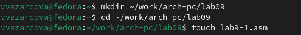
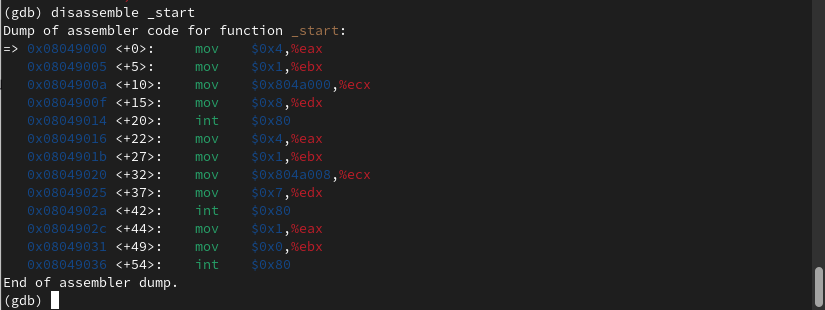

---
## Front matter
title: "Отчёт по лабораторной работе №9"
subtitle: "Дисциплина: Архитектура Компьютера"
author: "Азарцова Вероника Валерьевна"

## Generic otions
lang: ru-RU
toc-title: "Содержание"

## Bibliography
bibliography: bib/cite.bib
csl: pandoc/csl/gost-r-7-0-5-2008-numeric.csl

## Pdf output format
toc: true # Table of contents
toc-depth: 2
lof: true # List of figures
lot: true # List of tables
fontsize: 12pt
linestretch: 1.5
papersize: a4
documentclass: scrreprt
## I18n polyglossia
polyglossia-lang:
  name: russian
  options:
	- spelling=modern
	- babelshorthands=true
polyglossia-otherlangs:
  name: english
## I18n babel
babel-lang: russian
babel-otherlangs: english
## Fonts
mainfont: IBM Plex Serif
romanfont: IBM Plex Serif
sansfont: IBM Plex Sans
monofont: IBM Plex Mono
mathfont: STIX Two Math
mainfontoptions: Ligatures=Common,Ligatures=TeX,Scale=0.94
romanfontoptions: Ligatures=Common,Ligatures=TeX,Scale=0.94
sansfontoptions: Ligatures=Common,Ligatures=TeX,Scale=MatchLowercase,Scale=0.94
monofontoptions: Scale=MatchLowercase,Scale=0.94,FakeStretch=0.9
mathfontoptions:
## Biblatex
biblatex: true
biblio-style: "gost-numeric"
biblatexoptions:
  - parentracker=true
  - backend=biber
  - hyperref=auto
  - language=auto
  - autolang=other*
  - citestyle=gost-numeric
## Pandoc-crossref LaTeX customization
figureTitle: "Рис."
tableTitle: "Таблица"
listingTitle: "Листинг"
lofTitle: "Список иллюстраций"
lotTitle: "Список таблиц"
lolTitle: "Листинги"
## Misc options
indent: true
header-includes:
  - \usepackage{indentfirst}
  - \usepackage{float} # keep figures where there are in the text
  - \floatplacement{figure}{H} # keep figures where there are in the text
---

# Цель работы

Целью данной лабораторной работы является приобретение навыков написания программ с использованием подпрограмм, знакомство с методами отладки при помощи GDB и его основными возможностями.

# Теоретическое введение

Отладка — это процесс поиска и исправления ошибок в программе. В общем случае его можно разделить на четыре этапа:

1. Обнаружение ошибки;

2. Поиск её местонахождения;

3. Определение причины ошибки;

4. Исправление ошибки.

Наиболее часто применяют следующие методы отладки:

1. Создание точек контроля значений на входе и выходе участка программы (например, вывод промежуточных значений на экран — так называемые диагностические сообщения);

2. Использование специальных программ-отладчиков.

Подпрограмма — это, как правило, функционально законченный участок кода, который можно многократно вызывать из разных мест программы. В отличие от простых переходов из подпрограмм существует возврат на команду, следующую за вызовом.  
Для вызова подпрограммы из основной программы используется инструкция call, которая заносит адрес следующей инструкции в стек и загружает в регистр eip адрес соответствующей подпрограммы, осуществляя таким образом переход. Затем начинается выполнение подпрограммы, которая, в свою очередь, также может содержать подпрограммы.

# Выполнение лабораторной работы

1. Создаю каталог для выполнения лабораторной работы №9 и файл lab09-1.asm в нём (рис. [-@fig:1]).

{#fig:1 width=70%}

Ввожу текст программы из листинга в файл lab09-1.asm (рис. [-@fig:2]).

{#fig:2 width=70%}

Создаю исполняемый файл и проверяю его работу (рис. [-@fig:3]).

{#fig:3 width=70%}

2. Создаю файл lab9-2.asm с текстом программа печати сообщения "Hello world!" (рис. [-@fig:4]).

{#fig:4 width=70%}

Получаю исполняемый файл. Для работы с GDB в исполняемый файл добавляю отладочную информацию, для этого трансляцию программы провожу с ключом‘-g’ и загружаю исполняемый файл в отладчик gdb (рис. [-@fig:5]).

{#fig:5 width=70%}

Запускаю программу в оболочке GDB (рис. [-@fig:6]).

{#fig:6 width=70%}

Запускаю программу с брейпоинтом на метке _start (рис. [-@fig:7]).

{#fig:7 width=70%}

Смотрю на дисассимилированный код программы с помощью команды disassemble начиная с метки _start (рис. [-@fig:8]).

{#fig:8 width=70%}

Смотрю на дисассимилированный код программы с синтаксом intel с помощью команды disassemble начиная с метки _start (рис. [-@fig:9]).

{#fig:9 width=70%}

Эти два отображения различаются тем, что в Intel’овском сначала пишется регистр, а потом адрес, причем без символа доллара и без символа процента, т.е. его вид упрощенный.

Включаю режим псевдографики для более удобного анализа программы (рис. [-@fig:10]).

{#fig:10 width=70%}

На предыдущих шагах была установлена точка останова по имени метки (_start). Проверяю это с помощью команды info breakpoints (кратко i b) (рис. [-@fig:11]).

{#fig:11 width=70%}

Устанавливаю ещё одну точку останова по адресу инструкции и проверяю (рис. [-@fig:12]).

{#fig:12 width=70%}

Выполняю 5 инструкций с помощью команды stepi (или si) и слежу за изменением значений регистров. Значения регистров ebx, ecx, edx и eax изменялись (рис. [-@fig:13]).

{#fig:13 width=70%}

Смотрю значение переменной msg1 по имени (рис. [-@fig:14]).

{#fig:14 width=70%}

Изменю первый символ переменной msg1 и msg2 (рис. [-@fig:15]).

{#fig:15 width=70%}

Выведу в разных форматах значение регистра edx (рис. [-@fig:16]).

{#fig:16 width=70%}

С помощью команды set измените значение регистра ebx (рис. [-@fig:17]).

{#fig:17 width=70%}

Завершаю выполнение программы.

3. Копирую файл lab8-2.asm, созданный при выполнении лабораторной работы №8, с программой выводящей на экран аргументы командной строки в файл именем lab9-3.asm, создаю исполняемый файл, и загружаю его в отладчик с ключем --args (рис. [-@fig:18]).

{#fig:18 width=70%}

Устанавливаю точку останова перед первой инструкцией в программе и запускаю ее (рис. [-@fig:19]).

{#fig:19 width=70%}

Посмотрю остальные позиции стека – по адесу esp+4 располагается адрес в памяти где находиться имя программы, по адесу esp+8 храниться адрес первого аргумента, по аресу esp+12 – второго и т.д (рис. [-@fig:20]).

{#fig:20 width=70%}

Шаг 4 обусловлен разрядностью системы, а указатель void занимает 4 байта.

# Задания для самостоятельной работы

1. Преобразую программу из лабораторной работы 8, реализоваа вычисление функции как подпрограмму.

```NASM
%include 'in_out.asm'

SECTION .data
msg_func db "Функция: f(x) = 10x - 4", 0
msg_result db "Результат: ", 0

SECTION .text
GLOBAL _start

_start:
mov eax, msg_func
call sprintLF

pop ecx
pop edx
sub ecx, 1
mov esi, 0

next:
cmp ecx, 0h
jz _end
pop eax
call atoi

call _calculate_fx

add esi, eax
loop next

_end: 
mov eax, msg_result
call sprint
mov eax, esi
call iprintLF
call quit

_calculate_fx:
mov ebx, 10
mul ebx
sub eax, 4
```

2. Запускаю программу в режике отладичка и ппросматриваю изменение значений регистров. При выполнении инструкции mul ecx результат записывается в eax, но также меняет edx. Значение регистра ebx не обновляется, поэтому результат программа неверно подсчитывает функцию. Исправляю это и функция работает корректно.

``` NASM
%include 'in_out.asm'

SECTION .data
div: DB 'Результат: ', 0

SECTION .text
GLOBAL _start
_start:

mov ebx, 3
mov eax, 2
add ebx, eax
mov eax, ebx
mov ecx, 4
mul ecx
add eax, 5
mov edi, eax

mov eax, div
call sprint
mov eax, edi
call iprintLF

call quit
```


# Выводы

Подводя итоги данной лабораторной работы, я получила навыки написания программ с использованием подпрограмм, а так же познакомилась с методами отладки при помощи GDB.

# Список литературы{.unnumbered}

::: {#refs}
:::
