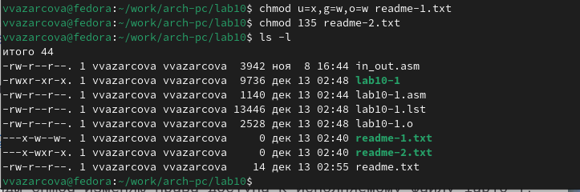

---
## Front matter
title: "Отчёт по лабораторной работе №10"
subtitle: "Дисциплина: Архитектура Компьютера"
author: "Азарцова Вероника Валерьевна"

## Generic otions
lang: ru-RU
toc-title: "Содержание"

## Bibliography
bibliography: bib/cite.bib
csl: pandoc/csl/gost-r-7-0-5-2008-numeric.csl

## Pdf output format
toc: true # Table of contents
toc-depth: 2
lof: true # List of figures
lot: true # List of tables
fontsize: 12pt
linestretch: 1.5
papersize: a4
documentclass: scrreprt
## I18n polyglossia
polyglossia-lang:
  name: russian
  options:
	- spelling=modern
	- babelshorthands=true
polyglossia-otherlangs:
  name: english
## I18n babel
babel-lang: russian
babel-otherlangs: english
## Fonts
mainfont: IBM Plex Serif
romanfont: IBM Plex Serif
sansfont: IBM Plex Sans
monofont: IBM Plex Mono
mathfont: STIX Two Math
mainfontoptions: Ligatures=Common,Ligatures=TeX,Scale=0.94
romanfontoptions: Ligatures=Common,Ligatures=TeX,Scale=0.94
sansfontoptions: Ligatures=Common,Ligatures=TeX,Scale=MatchLowercase,Scale=0.94
monofontoptions: Scale=MatchLowercase,Scale=0.94,FakeStretch=0.9
mathfontoptions:
## Biblatex
biblatex: true
biblio-style: "gost-numeric"
biblatexoptions:
  - parentracker=true
  - backend=biber
  - hyperref=auto
  - language=auto
  - autolang=other*
  - citestyle=gost-numeric
## Pandoc-crossref LaTeX customization
figureTitle: "Рис."
tableTitle: "Таблица"
listingTitle: "Листинг"
lofTitle: "Список иллюстраций"
lotTitle: "Список таблиц"
lolTitle: "Листинги"
## Misc options
indent: true
header-includes:
  - \usepackage{indentfirst}
  - \usepackage{float} # keep figures where there are in the text
  - \floatplacement{figure}{H} # keep figures where there are in the text
---

# Цель работы

Целью данной лабораторной работы является приобретение навыков написания программ для работы с файлами и изменение прав.

# Теоретическое введение

ОС GNU/Linux является многопользовательской операционной системой. И для обеспечения защиты данных одного пользователя от действий других пользователей существуют специальные механизмы разграничения доступа к файлам. Кроме ограничения доступа, данный механизм позволяет разрешить другим пользователям доступ данным для совместной работы.

# Выполнение лабораторной работы

1. Создаю каталог для программам лабораторной работы № 10, перехожу в него и создаю файлы lab10-1.asm, readme-1.txt и readme-2.txt (рис. [-@fig:1]).

{#fig:1 width=70%}

2. Ввожу в файл lab10-1.asm текст программы записи в файл сообщения (рис. [-@fig:2]).

{#fig:2 width=70%}

Создаю исполняемый файл и проверяю его работу (рис. [-@fig:3]).

{#fig:3 width=70%}

Программа работает - в файл readme.txt записывается строка (рис. [-@fig:4]).

{#fig:4 width=70%}

3. С помощью команды chmod изменяю права доступа к исполняемому файлу lab10-1,
запретив его выполнение и пытаюсь выполнить файл (рис. [-@fig:5]).

{#fig:5 width=70%}

Файл не исполняется, потому что я теперь не имею доступ к его запуску.

4. С помощью команды chmod изменяю права доступа к исполняемому файлу lab10-1,
добавив права на его выполнение и пытаюсь выполнить файл (рис. [-@fig:6]).

{#fig:6 width=70%}

Файл успешно исполняется, потому что я теперь имею доступ к его запуску.

5. Предоставляю права доступа к файлу readme-1.txt представленные в символьном виде, а для файла readme-2.txt – в двочном виде и проверяю правильность выполнения с помощью команды ls -l (рис. [-@fig:7]).

{#fig:7 width=70%}

# Задание для самостоятельной работы

1. Напишу программу работающую по следующему алгоритму:

* Вывод приглашения “Как Вас зовут?”

* ввести с клавиатуры свои фамилию и имя

* создать файл с именем name.txt

* записать в файл сообщение “Меня зовут”

* дописать в файл строку введенную с клавиатуры

* закрыть файл

```NASM
%include 'in_out.asm'

SECTION .data
filename db 'name.txt', 0
prompt db 'Как Вас зовут?', 0
intro db 'Меня зовут ', 0

SECTION .bss
name resb 255

SECTION .text
global _start
_start:
mov eax, prompt
call sprint

mov ecx, name
mov edx, 255
call sread

mov eax, 8
mov ebx, filename
mov ecx, 0744o
int 80h

mov esi, eax

mov eax, intro
call slen
mov edx, eax
mov ecx, intro
mov ebx, esi
mov eax, 4
int 80h

mov eax, name
call slen
mov edx, eax
mov ecx, name
mov ebx, esi
mov eax, 4
int 80h

mov ebx, esi
mov eax, 6
int 80h

call quit
```

Создам исполняемый файл и проверю его работу (рис. [-@fig:8]).

{#fig:8 width=70%}

Программа работает корректно.


# Выводы

Подводя итоги лабораторной работы, я прибрела навыки написания программ для работы с файлами и научилась редактировать права для файлов.

# Список литературы{.unnumbered}

::: {#refs}
:::
